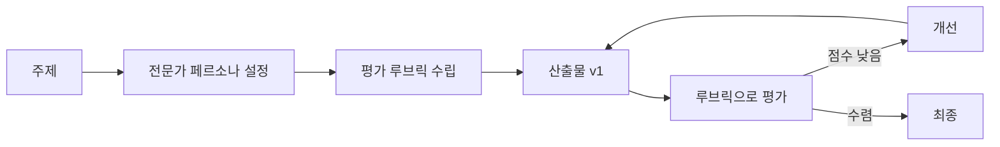
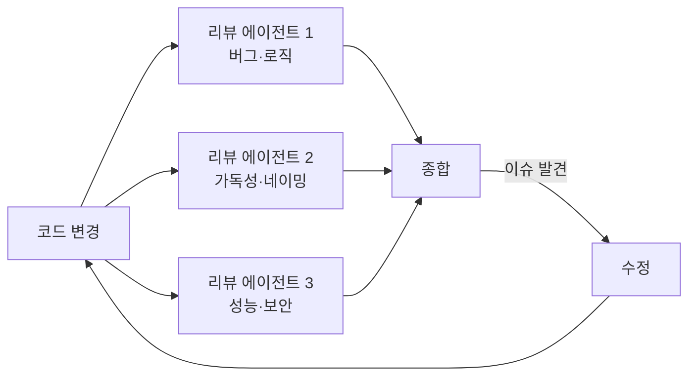

# F. Autoresearch & Self-Improving Loops

> Andrej Karpathy의 "autoresearch" 메커니즘을 개발 작업에 적용하기

## 왜 본문이 아니라 부록인가

Autoresearch는 매력적이지만 60분 강의에 넣기엔 위험했습니다.

- **이유 1**: 메타 패턴이라 입문~중급 수강생이 바로 적용하기 어려움
- **이유 2**: "효율적·일관된 활용" 메시지와 결이 다름 (autoresearch는 시스템 자동화 쪽)
- **이유 3**: 5가지 축이 익숙해진 다음의 **고급 응용**

그래서 부록으로 뺐습니다. **Part 2를 충분히 익힌 다음** 읽으시길 권합니다.

## 한 줄 정의

> **Autoresearch** = 전문가 페르소나 → 평가 루브릭 → 산출물 반복 평가·개선의 자동화 루프

## 핵심 아이디어

핵심 단계:

1. **전문가 페르소나 설정**: 평가에 적합한 가상 전문가 2~4명 (관점이 다른 사람들)
2. **루브릭 수립**: 5~7개 평가 항목 + 가중치 + 5점 척도
3. **산출물 평가**: 각 항목에 점수 + 코멘트
4. **개선**: 약점에 집중해 다음 버전 생성
5. **수렴**: 점수가 더 이상 오르지 않으면 종료

## 언제 쓰면 좋은가

### ✅ 잘 맞는 경우

- **복잡한 산출물** (문서, 강의 목차, 제안서, 아키텍처 결정서)
- **평가 기준이 명확**한 작업 (체크리스트로 표현 가능)
- **여러 관점이 필요**한 작업 (개발자/사용자/관리자)
- **시간 여유**가 있는 작업

> 이 강의의 목차 자체가 autoresearch로 만들어졌습니다. v1 → v2 → v2.1 → v2.2 (수렴).

### ❌ 안 맞는 경우

- **단순 구현** — 평가할 게 없음
- **한 번에 끝나는 작업** — 루프의 의미가 없음
- **실시간 응답** — 루프 시간이 비용
- **객관적 정답**이 있는 작업 — 그냥 답을 찾으면 됨

## 개발에 적용하는 법

### 패턴 1: 코드 리뷰 루프

각 리뷰어가 **다른 관점**을 가짐 → 단일 리뷰의 사각지대 보완.

### 패턴 2: 아키텍처 검토 루프

새 기능 설계서를:
- 보안 관점
- 성능 관점
- 유지보수성 관점
- 사용성 관점

으로 평가 → 각 관점의 점수가 모두 일정 수준 이상 될 때까지 반복.

### 패턴 3: 문서 개선 루프

기술 문서를:
- 신입 개발자 관점
- 시니어 관점
- 운영팀 관점

으로 평가 → "신입에게 어려운 부분"이 가장 약점이면 그 부분을 보강.

## 실전 팁

### ✅ 효과적인 사용

- 루브릭을 **숫자로** 만들기 (감으로 평가하면 수렴 안 됨)
- 페르소나를 **3~5명**으로 (너무 많으면 산만)
- 각 라운드 후 **변화량 기록** (개선이 정체되면 종료)
- **수렴 조건**을 미리 정하기 ("5점 만점에 4.5 이상" 등)

### ❌ 실패하는 사용

- 페르소나가 다 비슷한 관점 → 의미 없는 합의
- 루브릭이 모호 → 점수가 오락가락
- 무한 루프 → 종료 조건 필요
- 모든 작업에 적용 → 단순한 일에 과한 비용

## 이 강의의 목차가 만들어진 과정

- **v1**: 초안 (총점 2.95/5) — 실습이 후반에 몰림, 사례 부재
- **v2**: 챕터마다 미니 실습 + 사례 → 5.0/5
- **v2.1**: 하네스 엔지니어링 프레이밍 + 부록 G(이 페이지) 추가
- **v2.2**: 통합 시나리오 제거, 멀티 에이전트 본문 승격, 02 특강 사례 매핑

각 라운드마다:
- 교육 디자이너 / 시니어 개발자 / AI 헤비유저 페르소나가 평가
- 6개 항목 루브릭 (충실도/따라하기/사례/분량/재사용성/서사)
- 점수가 5.0에 수렴할 때까지 반복

이게 autoresearch의 실제 사용 예입니다.

## 🤖 AI Pro의 skill-creator — Autoresearch가 빌트인된 형태

흥미롭게도 AI Pro에는 이 패턴이 **빌트인 메타스킬**로 들어 있습니다. `skill-creator`가 그것입니다.

동작 방식:

1. 사용자가 "코드 리뷰 스킬을 만들고 싶다" 같은 요청
2. **skill-creator가 인터뷰 시작** — 어떤 언어/프레임워크, 어떤 관점, 출력 형식
3. 인터뷰 결과로 `SKILL.md` 초안 작성
4. 2~3개 테스트 프롬프트 자동 생성, **with-skill / baseline 병렬 실행**
5. **브라우저 뷰어에서 비교** + 피드백
6. 피드백 반영 → 재테스트 (만족할 때까지 3~5 반복)

이게 바로 **루브릭 기반 반복 개선 루프**입니다. 다른 점이 있다면 — 평가 항목이 "Skill 트리거 정확도 + 결과 품질"로 좁혀져 있고, 정성·정량 평가를 모두 지원합니다.

> AI Pro 사용자는 별도 도구나 프롬프트 엔지니어링 없이 `skill-creator`를 직접 호출하면 본 챕터의 반복 개선 루프를 즉시 운영할 수 있습니다.

## 정리

- Autoresearch = 전문가 + 루브릭 + 반복의 메타 패턴
- 모든 작업에 쓰지 마세요 — **복잡하고 평가 가능한 것**에만
- Part 2의 5가지 축이 익숙해진 다음 적용하면 큰 도구가 됩니다
- 이 강의 자체가 autoresearch의 결과물입니다
