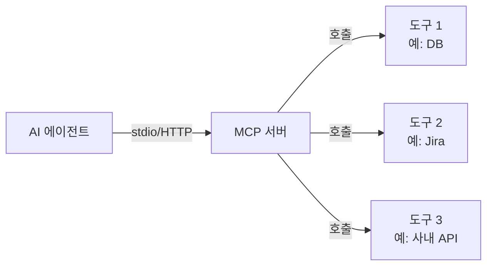

# B. MCP 입문

> Model Context Protocol — 에이전트의 세계를 넓히는 표준

## 왜 본문이 아니라 부록인가

MCP는 매우 강력하지만, **60분 강의 본문에 넣기엔 진입장벽이 있다**고 판단했습니다.

- 처음 듣는 사람에게는 추상적
- 실전 가치는 직접 써봐야 체감됨
- Part 2의 5가지 축을 먼저 익힌 사람에게 더 잘 들어옴

**MCP는 5가지 축이 자리 잡은 다음의 "가속기"** 입니다. 그래서 부록입니다.

## 한 줄 정의

> **MCP**는 에이전트가 **외부 도구·데이터에 접근하는 표준 프로토콜**입니다.

비유:
- HTTP가 브라우저↔서버의 표준이라면
- MCP는 **AI 에이전트↔도구/데이터**의 표준

## 무엇이 가능해지는가

MCP 서버를 붙이면 에이전트가:

- **DB 쿼리** (사내 RDB·NoSQL 직접 조회)
- **사내 시스템 호출** (Jira, Confluence, 사내 API)
- **파일 시스템 조작** (특정 폴더만 안전하게)
- **팀 자산 접근** (우아한형제들 MCP stdio 사례의 npm 패키지 자산)
- **외부 SaaS 통합** (Slack, Notion, Linear 등)

…를 **한 번의 설치로** 할 수 있게 됩니다.

## 동작 방식 (간단히)

- 에이전트는 MCP 서버를 **표준 인터페이스**로 호출
- MCP 서버가 실제 도구를 어떻게 부르는지는 **숨겨짐**
- 새 도구가 생기면 MCP 서버만 추가 — 에이전트 본체 변경 없음

## stdio 방식이란

우아한형제들 MCP stdio 사례(Part 2.1)의 핵심이었던 **stdio 기반 MCP**:

- MCP 서버를 **표준 입출력**으로 통신하는 프로세스로 띄움
- npm 패키지로 배포하면 `npm install` → 즉시 사용
- 별도 서버 인프라 필요 없음
- **개인 PC 안에서 동작**하는 경량 방식

이 방식 덕분에 해당 팀은 "사내 인프라 없이도 팀 자산을 npm으로 전파"할 수 있었습니다.

## 시작하는 법

### 1단계: 기존 MCP 서버 써보기

직접 만들기 전에 **공개된 MCP 서버**를 먼저 붙여보세요. 예:

- 파일시스템 MCP
- GitHub MCP
- SQLite MCP

각 도구의 공식 문서에서 등록 방법을 확인합니다.

### 2단계: 팀 자산을 MCP로 노출

우아한형제들 MCP stdio 사례를 따라:

1. 팀이 자주 쓰는 프롬프트·스킬·규칙을 한 폴더에 모음
2. 그 폴더를 npm 패키지로 만듦
3. MCP stdio 서버 형태로 노출
4. 팀원에게 `npm install` 안내

### 3단계: 사내 시스템 통합

가장 강력하지만 가장 신중해야 하는 단계.

- DB 직접 호출 — **읽기 전용으로 시작**
- 권한 관리 필수
- 감사 로그 필수

## 안전 가이드

MCP는 강력한 만큼 위험도 큽니다.

### ✅ 권장

- **읽기 전용** 도구부터 시작
- 권한을 **폴더·테이블 단위로 좁힘**
- 모든 호출 **로깅**
- 사내 사용 시 **승인 프로세스** 거치기

### ❌ 피할 것

- 처음부터 쓰기 권한 부여
- 인증 없는 외부 노출
- 프로덕션 DB 직접 연결
- 비밀키를 MCP 서버 코드에 하드코딩

## 🤖 AI Pro의 MCP 지원

AI Pro에서도 MCP를 사용할 수 있지만, 본 문서 작성 시점 기준 **(Beta)** 단계입니다.

**위치**: Settings → **(Beta) MCP** 탭

**확인 방법**:
- AI Pro CLI에서 `/mcp` 슬래시 커맨드로 등록된 MCP 도구 목록 조회
- 등록은 `~/.gemini/settings.json` 등에서 mcp 서버 정보 추가 (gemini-cli 기반)

**조심할 점**:
- Beta 단계이므로 사내 정책상 사용 가능 여부 확인 필요
- 외부 인프라로 호출이 나가는 MCP는 사내 보안 정책과 충돌 가능성
- 사내 시스템을 노출하는 MCP는 **승인 프로세스** 필수

**AI Pro 사용자가 MCP를 시작할 때 권장 순서**:
1. 우선 **Skills + Workspace Indexing**으로 충분히 해결되는 작업인지 확인
2. 그래도 외부 시스템 통합이 꼭 필요하면 사내 보안 검토 → Beta MCP 등록
3. 읽기 전용 도구부터, 모든 호출 로깅 필수

## 더 알아보려면

> 공식 자료는 빠르게 변하므로 직접 확인하세요. 현재 최신 사양은 modelcontextprotocol.io 등에서 확인할 수 있습니다.

**이 강의 본문에서 MCP가 등장한 곳**:
- [Part 2.1 Context Engineering](../part-2-what/context-engineering) — 우아한형제들 MCP stdio 사례

## 정리

- MCP = 에이전트 ↔ 도구/데이터의 표준 프로토콜
- stdio 방식이면 인프라 없이 npm으로 전파 가능
- 우아한형제들 MCP stdio 사례는 MCP가 **팀 컨텍스트 중앙화**의 강력한 도구임을 보여줌
- 5가지 축을 익힌 다음의 **가속기**로 활용
