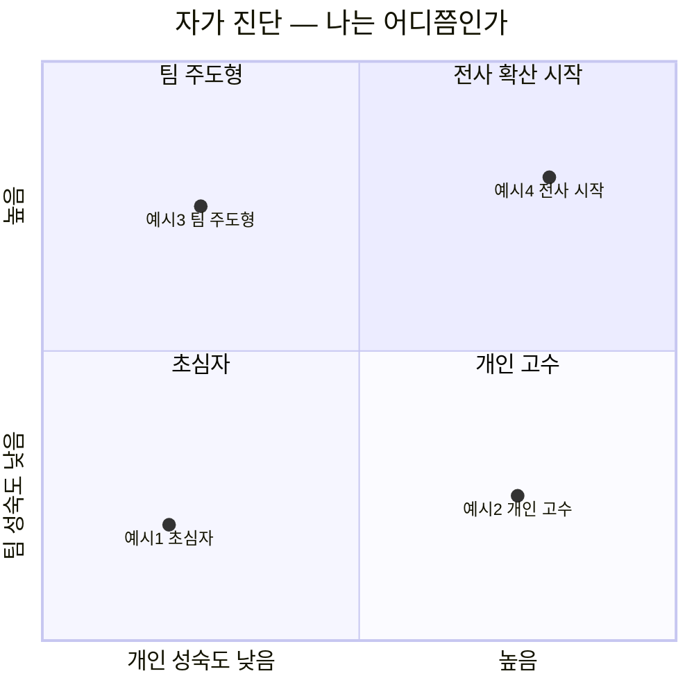

# 0.2 강의 + 문서 사용법

이 강의는 **영상**과 **문서 사이트**(지금 보고 계신 이 사이트) 두 축으로 구성됩니다.

## 각자의 역할

### 🎬 영상 (60~80분)

- **핵심 원칙** 5가지를 스토리로 전달
- **현장 사례** 중심의 내러티브
- **미니 실습** 화면 공유로 감 잡기
- 한 번에 쭉 보시길 권장

### 📚 문서 사이트 (이 사이트)

- 영상보다 **더 상세**한 설명
- **코드 예시** 전문, 템플릿, 체크리스트
- **부록**: MCP, 안티패턴 카탈로그, Autoresearch 등 심화
- 강의 후 **레퍼런스**로 수시 참조

**중요**: 영상과 문서는 **같은 것의 다른 밀도**가 아니라, **서로를 보완**합니다. 영상은 맥락·감정·스토리. 문서는 구조·코드·레퍼런스.

## 경로 선택 전 자가 진단

어느 경로로 갈지는 여러분의 **현재 위치**에 따라 달라집니다. 두 가지 축으로 자리를 잡아봅시다.

### 질문 2개

1. **개인 성숙도** — 나 혼자 AI 에이전트를 얼마나 체계적으로 쓰고 있는가?
   - 낮음: "가끔 쓰긴 하는데 매번 감으로" / 프로젝트에 CLAUDE.md·AGENTS.md 없음
   - 높음: Plan Mode·서브에이전트·훅을 일상적으로 사용 / 프로젝트별 컨텍스트 파일 유지

2. **팀 성숙도** — 우리 팀이 AI 에이전트를 얼마나 **일관되게** 쓰는가?
   - 낮음: 팀원마다 방식이 제각각 / 공유된 규칙 없음
   - 높음: 팀 공통 CLAUDE.md 존재 / 워크숍·리뷰 체계 있음

### 분면별 수강 경로

| 분면 | 특징 | 추천 경로 | 우선 챕터 |
|---|---|---|---|
| **초심자** (Q3) | 개인·팀 모두 초기 | **경로 A** (처음 듣기) | Part 1 → Part 2 → Part 3 |
| **개인 고수** (Q4) | 혼자는 잘 쓰는데 팀은 제각각 | **경로 B** (팀 도입) | **Part 4** 집중 — 워크숍·조직 확산 |
| **팀 주도형** (Q2) | 팀 의지는 있는데 내가 아직 약함 | **경로 A + B** | **Part 3 먼저** (내가 먼저 강해지기) → Part 4 |
| **전사 확산 시작** (Q1) | 이미 일정 궤도 | **경로 C** (특정 주제) | Part 4.2 조직 확산 로드맵 + 부록 심화 |

**초심자가 Part 4부터 읽으면 힘듭니다.** 반대로 개인 고수가 Part 1부터 읽으면 지루합니다. 자기 자리를 먼저 찾고 시작하세요.

## 수강 경로

### 경로 A: 처음 듣는 경우 (권장)

1. 영상을 한 번 쭉 본다 (60~80분, 끊지 않고)
2. 이 문서 사이트의 Part 2를 다시 읽는다
3. 자기 프로젝트에 CLAUDE.md를 시도해본다 (Part 3.1 → 1주일 가이드 3.2)
4. 막히는 부분만 부록·사례 상세 참조

### 경로 B: 팀에 도입하려는 경우

1. 영상을 본다
2. **Part 3 (HOW — 내가 시작하기)** → **Part 4 (IF — 팀으로 확산)** 순서로 정독
3. 팀 워크숍용으로 **Part 1.2 안티패턴 자가진단** 복사해서 사용
4. 팀 CLAUDE.md 초안 만들기 (3.1 템플릿) + 1주일 가이드 (3.2)

### 경로 C: 특정 주제만 필요한 경우

각 챕터가 독립적으로 읽히도록 설계했습니다. 필요한 것만 골라 보세요.

| 관심사 | 추천 챕터 |
|---|---|
| 팀에 공통 규칙 전파 | 2.1 Context + 3.1 CLAUDE.md + 4.1 워크숍 |
| 긴 작업이 자꾸 꼬임 | 2.3 Token + 2.5 Multi-Agent |
| AI 결과물 품질 | 2.4 Quality |
| "완료" 기준 설계 | 2.4 Quality + 2.2 Plan |

## 이 문서를 읽는 법

### 📍 사이드바는 순서가 아니라 지도

Part 0~3 + 부록 순서대로 읽어도 되고, 관심 있는 챕터만 골라 읽어도 됩니다. 각 챕터는 **다른 챕터로의 링크**가 촘촘하게 박혀 있습니다. 링크를 따라가면 자연스럽게 연결됩니다.

### 📍 💼 아이콘 = 현장 사례

각 챕터 끝의 💼 표시는 **우아한형제들의 실제 사례**입니다. 이론만 읽지 말고 사례까지 꼭 읽으세요. 사례가 진짜입니다.

### 📍 🛠️ 아이콘 = 미니 실습

각 챕터의 🛠️ 표시는 **3~5분짜리 미니 실습**입니다. 영상을 볼 때 한 번, 문서로 읽을 때 한 번 — 두 번 해보시길 권장합니다.

### 📍 TODO 표시가 남아 있는 부분

일부 챕터에는 `> TODO` 표시가 남아 있습니다. 이는 **계속 자라는 문서**라는 의미입니다. 피드백을 주시면 업데이트합니다.

## 피드백 주는 법

- GitHub Issues: https://github.com/imakerjun/effective-ai-coding-sds/issues
- 오탈자·추가 사례·잘못된 설명 모두 환영

## 준비됐다면

실습 환경 세팅으로 넘어가세요 → [0.3 실습 환경 세팅](./setup)
