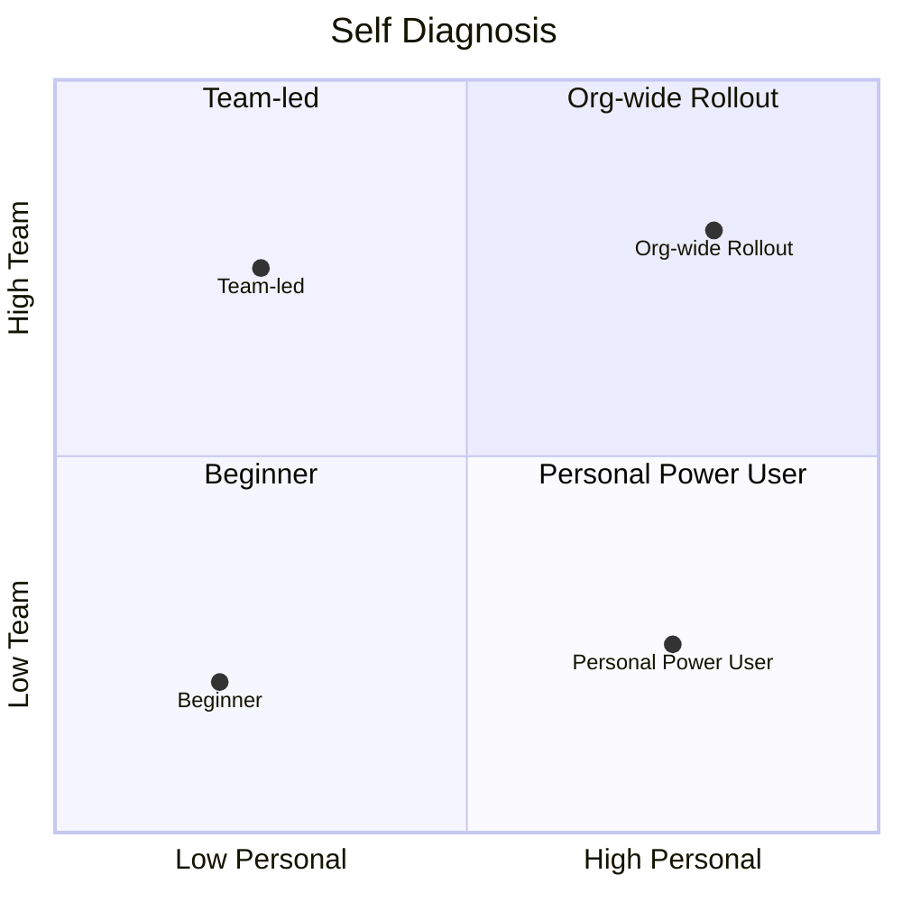

# 1.2 강의 + 문서 사용법

- **영상 (60~80분)** — 핵심 원칙 5가지 + 현장 사례 + 미니 실습
- **이 사이트** — 더 상세한 설명, 코드, 템플릿, 부록 (강의 후 reference)

## 자가 진단 — 나는 어디쯤인가

- **개인 성숙도 (x축)** — CLAUDE.md / Plan Mode / 서브에이전트를 일상적으로 쓰는가?
- **팀 성숙도 (y축)** — 팀에 공통 규칙·자산이 있는가?

| 분면 | 한글 이름 | 영문 라벨 |
|---|---|---|
| Q1 | 전사 확산 시작 | Org-wide Rollout |
| Q2 | 팀 주도형 | Team-led |
| Q3 | 초심자 | Beginner |
| Q4 | 개인 고수 | Personal Power User |

## 분면별 추천 경로

| 분면 | 추천 |
|---|---|
| **초심자** | Part 1 → 2 → 3 순서대로 |
| **개인 고수** | Part 2 빠르게 훑고 → **Part 4 집중** |
| **팀 주도형** | Part 3 (내가 먼저 강해지기) → Part 4 |
| **전사 확산 시작** | Part 4.2 + 부록 심화 |

> 초심자가 Part 4부터 읽으면 힘들고, 개인 고수가 Part 1부터 읽으면 지루합니다. **자기 자리부터** 시작하세요.

## 관심사로 빠르게 찾기

| 관심사 | 추천 챕터 |
|---|---|
| 팀에 공통 규칙 전파 | 2.1 + 3.1 + 4.1 |
| 긴 작업이 자꾸 꼬임 | 2.3 + 2.5 |
| AI 결과물 품질 | 2.4 |
| "완료" 기준 설계 | 2.4 + 2.2 |

## 아이콘 가이드

- 💼 — 우아한형제들 현장 사례
- 🛠️ — 3~5분짜리 미니 실습
- 🤖 — AI Pro에서는 이렇게 합니다

---

피드백·오탈자: [GitHub Issues](https://github.com/imakerjun/effective-ai-coding-sds/issues)

다음 → [1.3 실습 환경 세팅](./03-setup)
