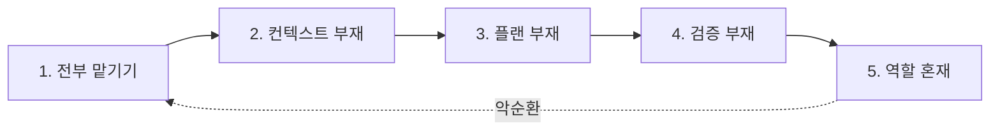

# 1.2 흔한 안티패턴 5가지

> 대부분의 문제는 새로운 게 아닙니다. 반복되는 5가지 패턴입니다.

아래 5가지는 제가 여러 팀·개발자를 관찰하면서 공통으로 발견한 패턴입니다. 하나라도 해본 적 있다면 — 정상입니다. 중요한 건 지금부터 어떻게 바꿀지입니다.

## 안티패턴 1: 전부 맡기기

> "이거 AI로 알아서 해줘"

1.1에서 다룬 강규한님 사례의 본질입니다.

- 맥락 설명 없이 큰 작업을 통째로 던짐
- AI가 추측으로 채움
- 결과: 컴파일도 안 되는 코드
- 수정이 처음부터 하는 것보다 오래 걸림

**해법**: Part 2.2 Plan-based Execution — **AI가 못하는 부분은 도구/사람이 담당**.

---

## 안티패턴 2: 컨텍스트 없이 프롬프트만

> "이 함수 리팩터링해줘"

- 같은 프롬프트를 **매번 처음부터** 다시 씀
- 팀 컨벤션·금지사항을 **매번 설명**
- AI가 **매번 같은 실수**를 반복

**증상**:
- 대화 시작마다 "아, 우리 팀은 Kotest 써" 같은 말을 반복
- 같은 질문에 대해 AI가 매번 다른 답을 줌
- 팀원마다 AI 결과물 스타일이 제각각

**해법**: Part 2.1 Context Engineering — **CLAUDE.md로 한 번만 쓰고 계속 씀**.

---

## 안티패턴 3: 플랜 없이 즉시 실행

> "바로 만들어줘"

- 요구사항이 불명확한데 코드부터 나옴
- 10분 후 "방향이 아닌데"
- 롤백 → 재시도 → 또 이상
- **여러분도 처음엔 뭘 원하는지 몰랐다는 게 진짜 문제**

**해법**: Part 2.2 Plan-based Execution — Plan Mode로 **실행 전에 합의**.

---

## 안티패턴 4: 검증 없이 완료 선언

> "AI가 완료했대"

- 에이전트가 "완료했습니다"라고 하면 그대로 믿음
- 실행은 커녕 읽어보지도 않음
- 며칠 뒤 프로덕션에서 터짐

**증상**:
- "AI가 썼는데 왜 안 되지?" → 읽어보면 명백히 틀림
- 테스트 없이 merge
- "완료의 정의"가 사람마다 다름

**해법**: Part 2.4 품질 검증 체계 — **"완료"는 코드에 박혀 있어야** 한다.

---

## 안티패턴 5: 하나의 에이전트에 다 몰기

> "탐색도, 구현도, 리뷰도 다 너가 해"

- 한 세션에 **탐색·계획·구현·검토**를 다 시킴
- 대화가 20턴 넘어가면 뭐가 뭔지 모르게 됨
- 자기가 쓴 코드를 자기가 리뷰 → 편향
- 토큰 윈도우 고갈 → 같은 파일을 10번째 다시 읽음

**증상**:
- "이 파일 다시 읽어볼게요" 루프
- 앞에서 내린 결정을 뒤에서 까먹음
- 자기가 만든 버그를 자기가 못 찾음

**해법**: Part 2.3 Token Optimization + Part 2.5 Multi-Agent — **역할을 나누고 컨텍스트를 격리**.

---

## 5가지의 공통 구조

재미있는 건 이 5가지가 **서로 독립된 문제가 아니라는 것**입니다. 하나를 놔두면 다른 것들이 줄줄이 따라옵니다.

- 컨텍스트가 없으니까 → 전부 맡길 수밖에
- 플랜이 없으니까 → 검증할 기준도 없음
- 역할이 섞여 있으니까 → 객관적 리뷰 불가

**5가지는 하나의 뿌리에서 나옵니다: 하네스가 없다는 것.**

이게 Part 2에서 하나씩 풀어갈 주제입니다. 각 안티패턴에 대응하는 원칙이 이미 매핑되어 있습니다.

| 안티패턴 | 대응 원칙 |
|---|---|
| 1. 전부 맡기기 | 2.2 Plan-based Execution |
| 2. 컨텍스트 없음 | 2.1 Context Engineering |
| 3. 플랜 없음 | 2.2 Plan-based Execution |
| 4. 검증 없음 | 2.4 품질 검증 체계 |
| 5. 역할 혼재 | 2.3 Token + 2.5 Multi-Agent |

## 자가 진단

지금 여러분의 작업에 몇 개가 해당되나요?

- [ ] AI에게 큰 작업을 통째로 던진 적이 있다
- [ ] CLAUDE.md 같은 프로젝트 컨텍스트 파일이 **없다**
- [ ] Plan Mode를 거의 안 쓴다
- [ ] AI가 "완료"라고 하면 그냥 믿는다
- [ ] 하나의 에이전트 세션으로 모든 걸 처리한다

**3개 이상 체크 → 이 강의가 도움이 될 확률이 매우 높습니다.** Part 2부터 하나씩 따라가 봅시다.
