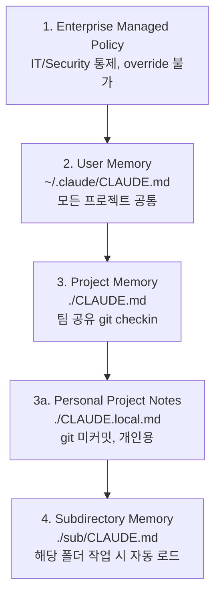
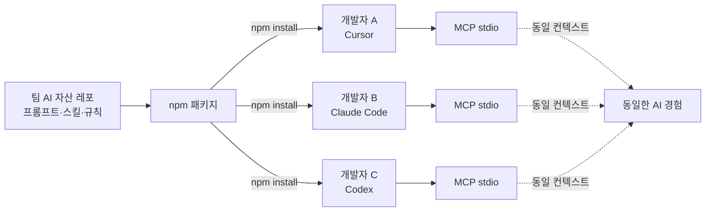

# 2.1 Context Engineering

> 에이전트에게 세계를 알려주기

## 정의 — Anthropic의 공식 표현

Anthropic은 [Effective context engineering for AI agents](https://www.anthropic.com/engineering/effective-context-engineering-for-ai-agents)에서 다음과 같이 정의합니다:

> **"Context engineering = 모델의 한정된 attention budget에 들어가는, 가장 작지만 high-signal 한 토큰 집합을 찾는 일."**

핵심 단어 두 개입니다:

- **attention budget** — LLM이 한 번에 집중할 수 있는 양은 유한합니다
- **high-signal** — 양이 아니라 **밀도**가 결정합니다

> 이 정의를 한 줄로 압축하면: **"덜 주는 게 더 잘 되는 역설"** 입니다. (Part 2.3에서 다시 만납니다)

## 왜 Context가 맨 앞인가

Part 2의 5가지 축 중에 Context가 가장 먼저인 이유는 단순합니다. **컨텍스트 없이는 나머지 4가지가 다 무의미**해지기 때문입니다.

- Plan? — 뭘 기반으로 계획할지 모름
- Token 최적화? — 잘못된 컨텍스트를 열심히 압축하는 것뿐
- Quality 검증? — 무엇이 "맞는지"의 기준이 없음
- Multi-Agent? — 여러 에이전트가 같은 오해를 공유

**컨텍스트는 하네스의 토대입니다.**

## 두 가지 전략 — Pre-load vs Just-in-Time

Anthropic의 글에서 가장 중요한 구분:

| 전략 | 무엇인가 | 언제 |
|---|---|---|
| **Pre-load** (upfront) | 세션 시작 시 컨텍스트에 미리 박아둠 | 모든 세션에 공통으로 필요한 규칙·구조 |
| **Just-in-Time** (on-demand) | 필요할 때 도구로 가져옴 | 작업마다 다른, 양이 큰 정보 |

> Claude Code는 **하이브리드 모델**을 씁니다. CLAUDE.md는 **upfront로 전부 로드**, 코드 파일은 `glob`/`grep`/`Read`로 **just-in-time**.

이 구분이 중요한 이유: **모든 걸 pre-load하면 attention budget이 빠르게 고갈**됩니다. 반대로 모든 걸 just-in-time으로 하면 매번 헤맵니다. **둘 사이의 균형**이 곧 컨텍스트 엔지니어링입니다.

## CLAUDE.md 4계층 — 공식 문서 기준

[Manage Claude's memory](https://docs.claude.com/en/docs/claude-code/memory) 공식 문서에 명시된 계층입니다.



| 계층 | 위치 | 적용 범위 | 우선순위 |
|---|---|---|---|
| **Enterprise** | OS별 시스템 경로 | 조직 전체 | 최상 (override 불가) |
| **User** | `~/.claude/CLAUDE.md` | 내 모든 프로젝트 | 낮음 |
| **Project** | `./CLAUDE.md` | 팀 공유 | User보다 우선 |
| **Project (개인)** | `./CLAUDE.local.md` | 나만, git 제외 | Project와 병합 |
| **Subdirectory** | `./sub/CLAUDE.md` | 해당 폴더 작업 시 | 작업 위치 기반 자동 로드 |

**Precedence Rule**: 충돌 시 Enterprise > Project > User. 예: 회사가 "raw SQL 금지"라고 했으면 어떤 프로젝트도 override 못 합니다.

## 공식 베스트 프랙티스 5가지

[Claude Code Best Practices](https://code.claude.com/docs/en/best-practices) 와 [HumanLayer의 "Writing a good CLAUDE.md"](https://www.humanlayer.dev/blog/writing-a-good-claude-md) 에서 반복적으로 강조되는 핵심:

### 1. `/init` 으로 시작하라

처음부터 빈 파일을 채우려 하지 말고, `/init` 명령으로 프로젝트 구조를 분석한 초안을 받은 뒤 다듬으세요.

### 2. 200줄 안에서 자르세요

Claude Code는 CLAUDE.md를 **길이 무관 전체 로드**하지만 — *"짧을수록 instruction adherence가 높아진다"* 가 공식 문서 표현입니다. 길어지면 중요한 규칙이 묻힙니다. **공식 권장 한도는 200줄**.

### 3. 통제(enforced configuration)가 아니라 **컨텍스트로 취급**됩니다

CLAUDE.md는 강제 설정이 아니라 가이드입니다. Claude가 100% 따른다고 생각하지 마세요. 따라서 **정말 강제하고 싶은 건 코드/훅/CI**에 박는 것이 안전합니다 (Part 2.4 Quality와 연결).

### 4. WHY · WHAT · HOW를 먼저

좋은 CLAUDE.md는 프로젝트의 "왜 존재하는가"부터 시작합니다. 컨벤션 나열만 있으면 Claude가 의도를 추정하다가 엉뚱한 방향으로 갑니다.

### 5. AI가 자주 헤매는 것을 별도 섹션으로

이건 강의의 권고이자 실전 베스트 프랙티스입니다. 컨벤션은 다른 문서에도 있을 수 있지만, **"지난주에 AI가 틀렸던 것"** 은 CLAUDE.md에밖에 안 담깁니다.

## 🤖 AI Pro에서는?

> **AI Pro의 1차 컨텍스트 파일은 `AGENTS.md`** 입니다. (`CLAUDE.md`가 아닙니다.)

AI Pro 공식 안내:
> *"AI Pro CLI와 같은 AGENT 도구를 이용해 작업을 수행할 경우 **AGENTS.md 및 규칙에 대한 문서 정의가 필수적**입니다."*
>
> *"Create AGENTS.md files to customize your interactions with AIPRO"* (시작 화면 팁)

### 두 파일의 역할 분리

| 파일 | AI Pro에서의 역할 | 위치 |
|---|---|---|
| **`AGENTS.md`** | Claude Code의 CLAUDE.md에 가장 가까움 — 프로젝트 개요·기술스택·컨벤션·빌드/실행 방법 | 프로젝트 루트 |
| **`Rules`** | "행동 방식" 지침 (Cursor의 Rules와 동일 개념) — 전역/프로젝트 범위에서 항상 적용 | `~/.aipro/rules/*.md` 또는 `.aipro/rules/*.md` |

이 둘은 **상호 보완**입니다. AGENTS.md는 "이 프로젝트가 뭐인지", Rules는 "AI Pro가 항상 어떻게 행동해야 하는지".

### 매핑 표

| 개념 | Claude Code | AI Pro |
|---|---|---|
| 프로젝트 컨텍스트 (1차) | `./CLAUDE.md` | **`./AGENTS.md`** ⭐ |
| 사용자 글로벌 | `~/.claude/CLAUDE.md` | `~/.aipro/rules/*.md` (Personal Rules) |
| 프로젝트 로컬 메모 | `./CLAUDE.local.md` | `.aipro/rules/*.md` (Project Rules) |
| 자동 생성 | `/init` | **`/init`** (동일 명령) |
| 세션 컨텍스트 | 대화 + `@file` | Chat 입력창 + `@file` |

> ⚠️ **Rules의 합산 10,000자 제한**: AGENTS.md와 별개로, Project Rules + Personal Rules는 합쳐 10,000자까지만 LLM에 전달됩니다. 핵심 규칙을 Project Rules 앞쪽에 두세요.

## 🛠️ 개인용 미니 실습 (5분)

> **실습 저장소**: [autoresearch-harness-steps/step-1-context](https://github.com/imakerjun/autoresearch-harness-steps/tree/master/harness-steps/step-1-context) — Karpathy의 `program.md`를 분석하고 자기 CLAUDE.md / AGENTS.md를 만들어보는 실습입니다.

지금 작업 중인 프로젝트에 컨텍스트 파일을 5분 안에 만듭니다.

### Step 1 — `/init` 으로 초안 받기

| 도구 | 명령 |
|---|---|
| Claude Code | `/init` → `CLAUDE.md` 자동 생성 |
| AI Pro CLI | `/init` → `AGENTS.md` 자동 생성 |

### Step 2 — 핵심 5섹션만 남기기

자동 생성된 초안에서 아래 5섹션만 남기고 나머지는 나중에 채워도 됩니다:

```markdown
# [프로젝트명]

## 이 레포가 뭔지 (1~2줄)

## 디렉터리 구조 (주요 폴더만)

## 코딩 컨벤션 (지금 당장 지켜야 할 것 5개)

## AI가 자주 헤매는 것 3가지 ⭐ 가장 가치 있는 섹션
- 지난주 AI가 틀렸던 것 1:
- 지난주 AI가 틀렸던 것 2:
- 지난주 AI가 틀렸던 것 3:

## 건드리면 안 되는 것
```

### Step 3 — Before/After 검증

같은 요구사항을 두 번 시도:

1. CLAUDE.md/AGENTS.md **없이** 새 세션 → 결과 저장
2. CLAUDE.md/AGENTS.md **있는 상태**에서 새 세션 → 결과 비교

비교 포인트:
- 컨벤션 위반이 줄었는가?
- "이건 어떻게 해요?" 같은 되묻기가 줄었는가?
- 결과 코드를 그대로 받아들일 수 있는가?

이 한 번의 비교가 **가장 강력한 학습 경험**입니다.

### Step 4 — 관찰 모드로 1주일

만든 다음 1주일간:
- AI가 또 헤매는 순간 즉시 그 규칙을 CLAUDE.md/AGENTS.md에 추가
- 매일 1~2줄씩만 자라도 충분
- 1주일 뒤 확인하면 처음과 다른 문서가 됨

이게 **"살아 있는 컨텍스트"** 의 시작입니다. (자세한 작성 템플릿은 [부록 G](../appendix/G-claude-md-template))

---

## 💼 현장 사례: 우아한형제들 — MCP로 팀 컨텍스트 중앙화

CLAUDE.md/AGENTS.md까지는 개인이 할 수 있습니다. 그런데 **팀이 같은 컨텍스트를 공유하는 건 다른 문제**입니다. 우아한형제들 기술블로그에 공개된 [조현석 님의 글](https://techblog.woowahan.com/25986/)에서 가져온 사례입니다.

### 문제

해당 팀의 상황:

- 프롬프트, 스킬, 규칙 같은 AI 자산이 팀원별 IDE·로컬에 **흩어져 있음**
- Cursor에서 쓰던 걸 Claude Code로 옮기면 **처음부터 재설정**
- 누가 어떤 프롬프트를 갖고 있는지 **아무도 모름**
- 공유는 슬랙에 링크로 → 며칠 뒤 잊혀짐

**"공유는 했지만 전파는 안 된" 상태입니다.**

### 해결

글에서 소개된 접근:

> **MCP stdio 기반으로 AI 자산을 npm 패키지로 중앙화**



작동 방식:
1. 팀 AI 자산을 **하나의 npm 패키지**로 만듦
2. 각 개발자가 `npm install`
3. 어떤 IDE에서든 MCP stdio를 통해 **같은 자산에 접근**
4. 자산이 업데이트되면 `npm update` 한 번으로 전파
5. **버전 관리 O, 변경 이력 추적 O**

### 핵심 인사이트

> **"공유가 아니라 설치로 전파"**
>
> 공유는 듣고 잊을 수 있지만, 설치된 건 쓸 수밖에 없다.

> 출처: [흩어져 있는 AI 자산, 'MCP stdio'로 헤쳐모여!](https://techblog.woowahan.com/25986/) (조현석, 2026.03)

이 한 문장이 팀 컨텍스트 엔지니어링의 본질입니다.

### 이 사례가 증명하는 것

- **Context는 한 번 쓰는 게 아니라 배포하는 것**이다
- 개인의 CLAUDE.md → 팀의 공유 자산으로 올라가는 순간, **비로소 팀의 하네스**가 된다
- Cursor든 Claude Code든 Codex든 — **도구가 달라져도 컨텍스트는 유지**되어야 한다

## 여러분 팀에서 시작하는 법

한 번에 MCP·npm 패키지까지 가지 마세요. 순서를 지키면 됩니다:

1. **개인**: 내 프로젝트에 CLAUDE.md/AGENTS.md 하나 만들기 (오늘)
2. **팀 1단계**: 팀 레포에 공통 컨텍스트 파일 체크인 (이번 주)
3. **팀 2단계**: 자주 쓰는 프롬프트·스킬을 하나의 폴더로 모으기
4. **팀 3단계**: 그 폴더를 패키지로 만들어 `npm install`로 전파 (조현석 사례)

각 단계마다 "이 자산이 실제로 전파되고 있는가?"만 검증하면 됩니다.

## 정리

- **Context Engineering = attention budget을 가장 작지만 high-signal한 토큰으로 채우는 일** ([Anthropic 공식 정의](https://www.anthropic.com/engineering/effective-context-engineering-for-ai-agents))
- **두 전략의 균형**: pre-load (CLAUDE.md/AGENTS.md) + just-in-time (glob/grep)
- **4계층 hierarchy**: Enterprise → User → Project → Subdirectory ([공식 문서](https://docs.claude.com/en/docs/claude-code/memory))
- **공식 권장 한도 200줄**, 짧을수록 instruction adherence ↑
- **AI Pro의 1차 파일은 AGENTS.md**, Rules는 행동 지침 보완
- 팀 레벨에서는 **"공유가 아닌 설치"** 가 되어야 진짜 전파됨

## 공식 출처

- [Anthropic — Effective context engineering for AI agents](https://www.anthropic.com/engineering/effective-context-engineering-for-ai-agents)
- [Claude Code — Manage Claude's memory](https://docs.claude.com/en/docs/claude-code/memory)
- [Claude Code — Best Practices](https://code.claude.com/docs/en/best-practices)
- [HumanLayer — Writing a good CLAUDE.md](https://www.humanlayer.dev/blog/writing-a-good-claude-md)
- AI Pro 사내 공식 가이드 (Rules / CLI / Skills 페이지)
