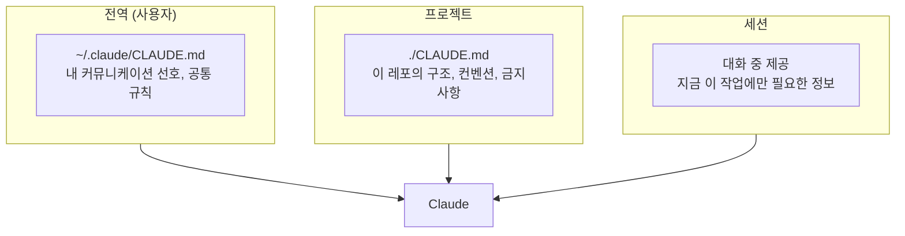
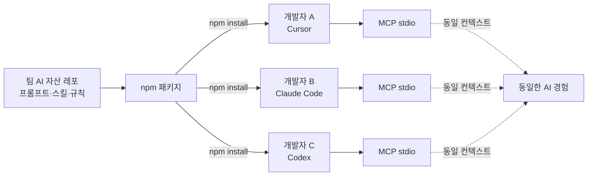

# 2.1 Context Engineering

> 에이전트에게 세계를 알려주기

## 왜 Context가 맨 앞인가

Part 2의 5가지 축 중에 Context가 가장 먼저인 이유는 간단합니다. **컨텍스트 없이는 나머지 4가지가 다 무의미**해지기 때문입니다.

- Plan? — 뭘 기반으로 계획할지 모름
- Token 최적화? — 잘못된 컨텍스트를 열심히 압축하는 것뿐
- Quality 검증? — 무엇이 "맞는지"의 기준이 없음
- Multi-Agent? — 여러 에이전트가 같은 오해를 공유

**컨텍스트는 하네스의 토대입니다.**

## 컨텍스트의 3계층

실무에서 컨텍스트는 한 덩어리가 아닙니다. 3개의 층으로 이해하는 게 도움이 됩니다.



| 계층 | 무엇을 담는가 | 특징 |
|---|---|---|
| **전역** | 내 말투, 언어, 기본 가이드 | 한 번 써두면 평생 씀 |
| **프로젝트** | 이 레포의 구조, 컨벤션, 금지사항, 주요 명령어 | 팀이 공유 |
| **세션** | 지금 이 작업에 필요한 파일·데이터 | 대화 끝나면 사라짐 |

**가장 자주 실수하는 지점**: 프로젝트 계층이 비어 있음. 세션마다 같은 말을 반복함.

## CLAUDE.md는 "README의 에이전트 버전"

프로젝트 레벨 컨텍스트의 표준 형식은 `CLAUDE.md` (Claude Code) 또는 `AGENTS.md` (Codex, 여러 에이전트 공통)입니다. 비유하자면:

- **README.md** = 사람 개발자를 위한 안내
- **CLAUDE.md** = AI 에이전트를 위한 안내

무엇이 들어가야 하는가:

```markdown
# 프로젝트명

## 개요
(이 프로젝트가 무엇인지 1~2줄)

## 디렉터리 구조
(주요 폴더의 목적)

## 코딩 컨벤션
- 테스트: Kotest FunSpec, given-when-then
- 네이밍: camelCase
- 금지: any 타입 사용 금지, console.log 커밋 금지

## 주요 명령어
| 명령어 | 설명 |
|---|---|
| pnpm dev | 개발 서버 |
| pnpm test | 전체 테스트 |

## 주의사항
- 아카이브 폴더는 건드리지 말 것
- 한글 경로 많음, 따옴표 필수
```

**핵심은 "AI가 매번 헤매는 것을 미리 적어두는 것"** 입니다.

## 🛠️ 미니 실습 (5분)

현재 작업 중인 프로젝트에 `CLAUDE.md`를 5분 안에 만듭니다.

### 최소 버전 템플릿

```markdown
# [프로젝트명]

## 이 레포가 뭔지 한 줄
[여기에 한 줄]

## AI가 자주 헤매는 것 3가지
1.
2.
3.

## 지켜야 할 컨벤션 3가지
1.
2.
3.

## 건드리면 안 되는 것
-
```

### 작성 팁

- **완벽하게 쓰려 하지 마세요**. 빈 칸으로 시작해 6개만 채우세요.
- **"AI가 자주 헤매는 것"이 가장 가치 있는 섹션**입니다. 지난주에 AI가 틀렸던 것 3개를 떠올리세요.
- CLAUDE.md는 **살아 있는 문서**입니다. AI가 또 같은 실수를 하면, 그 규칙을 여기에 추가하세요.

### 검증

같은 요구사항을 CLAUDE.md **있는 버전 / 없는 버전**으로 각각 시도 → 결과 비교.

---

## 💼 현장 사례: 조현석 (우아한형제들 프론트엔드) — MCP로 팀 컨텍스트 중앙화

CLAUDE.md까지는 개인이 할 수 있습니다. 그런데 **팀이 같은 컨텍스트를 공유하는 건 다른 문제**입니다.

### 문제

조현석님 팀의 상황:

- 프롬프트, 스킬, 규칙 같은 AI 자산이 팀원별 IDE·로컬에 **흩어져 있음**
- Cursor에서 쓰던 걸 Claude Code로 옮기면 **처음부터 재설정**
- 누가 어떤 프롬프트를 갖고 있는지 **아무도 모름**
- 공유는 슬랙에 링크로 → 며칠 뒤 잊혀짐

**"공유는 했지만 전파는 안 된" 상태입니다.**

### 해결

조현석님의 접근:

> **MCP stdio 기반으로 AI 자산을 npm 패키지로 중앙화**



작동 방식:
1. 팀 AI 자산을 **하나의 npm 패키지**로 만듦
2. 각 개발자가 `npm install`
3. 어떤 IDE에서든 MCP stdio를 통해 **같은 자산에 접근**
4. 자산이 업데이트되면 `npm update` 한 번으로 전파
5. **버전 관리 O, 변경 이력 추적 O**

### 핵심 인사이트

> **"공유가 아니라 설치로 전파"**
>
> 공유는 듣고 잊을 수 있지만, 설치된 건 쓸 수밖에 없다. — 조현석

> 출처: [흩어져 있는 AI 자산, 'MCP stdio'로 헤쳐모여!](https://techblog.woowahan.com/25986/) (조현석, 2026.03)

이 한 문장이 팀 컨텍스트 엔지니어링의 본질입니다.

### 이 사례가 증명하는 것

- **Context는 한 번 쓰는 게 아니라 배포하는 것**이다
- 개인의 CLAUDE.md → 팀의 공유 자산으로 올라가는 순간, **비로소 팀의 하네스**가 된다
- Cursor든 Claude Code든 Codex든 — **도구가 달라져도 컨텍스트는 유지**되어야 한다

## 여러분 팀에서 시작하는 법

한 번에 MCP·npm 패키지까지 가지 마세요. 순서를 지키면 됩니다:

1. **개인**: 내 프로젝트에 CLAUDE.md 하나 만들기 (오늘)
2. **팀 1단계**: 팀 레포에 공통 CLAUDE.md 체크인 (이번 주)
3. **팀 2단계**: 자주 쓰는 프롬프트·스킬을 하나의 폴더로 모으기
4. **팀 3단계**: 그 폴더를 패키지로 만들어 `npm install`로 전파 (조현석 사례)

각 단계마다 "이 자산이 실제로 전파되고 있는가?"만 검증하면 됩니다.

## 정리

- **Context Engineering = 에이전트가 헤매지 않게 세계를 먼저 알려주는 것**
- 3계층(전역·프로젝트·세션)을 의식하면 작업이 명확해짐
- CLAUDE.md는 "완벽한 문서"가 아니라 "계속 자라는 살아 있는 문서"
- 팀 레벨에서는 **"공유가 아닌 설치"**가 되어야 진짜 전파됨
