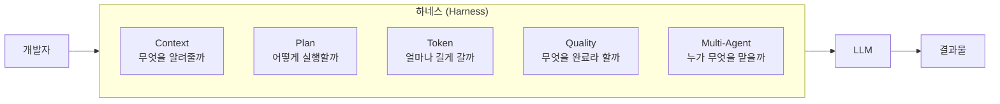
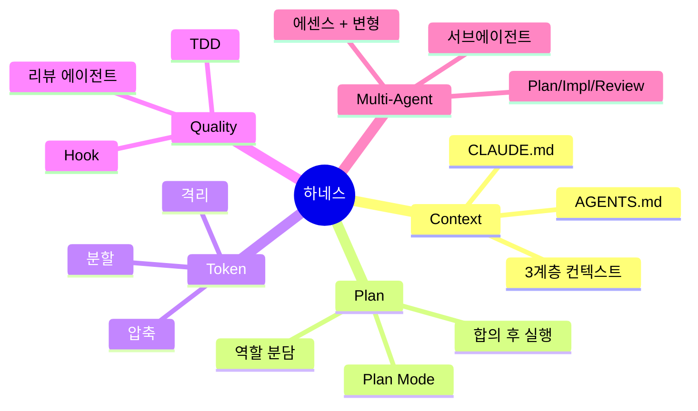

# 2.0 Harness Engineering

> **Agent = Model + Harness**

## 질문: 왜 같은 모델인데 결과가 다른가

같은 Claude를 쓰는데도 누구는 30분 만에 기능을 완성하고, 누구는 두 시간째 이상한 코드와 씨름 중입니다. 모델은 동일합니다. 차이는 어디서 오는가?

답은 **하네스(harness)** 입니다.

## 하네스란 무엇인가

> **하네스 = 에이전트에서 모델을 제외한 모든 것**

하네스(harness)라는 단어는 원래 말이 끄는 마구(馬具)에서 왔습니다. 말의 힘을 유용한 일로 향하게 하는 장치라는 뜻이죠. AI 에이전트 맥락에서는 — **LLM의 능력을 신뢰할 수 있는 작업 수행으로 향하게 하는 모든 인프라·규칙·도구**를 가리킵니다. 같은 모델이라도 무엇으로 감싸느냐에 따라 결과가 크게 달라집니다.

**이 강의의 Part 2는 하네스의 5가지 축을 하나씩 다룹니다.**

> **핵심 전환**: "AI에게 무엇을 시킬까"에서 **"AI에게 어떤 환경을 줄까"** 로.

<strong>📚 더 알아보기 — "Harness Engineering"의 출처와 강의 프레이밍 (선택)</strong>

이 섹션은 강의의 5가지 토픽이 어디서 왔고 1차 출처와 어떻게 다른지를 정직하게 정리합니다. **실습이 우선이라면 건너뛰어도 됩니다.**

#### 1차 출처들

이 용어는 한 사람이 만든 게 아니라 **2026년 초에 여러 곳에서 동시에 성숙한 개념**입니다.

| 출처 | 분류 | 구성 요소 |
|---|---|---|
| **Birgitta Böckeler** ([Martin Fowler 사이트](https://martinfowler.com/articles/exploring-gen-ai/harness-engineering.html)) | 3 components | Context Engineering · Architectural Constraints · Garbage Collection |
| **OpenAI Codex** ([원문](https://openai.com/index/harness-engineering/)) | 4 pillars | Context Architecture · Agent Specialization · Persistent Memory · Structured Execution |
| **Anthropic** ([Effective harnesses for long-running agents](https://www.anthropic.com/engineering/effective-harnesses-for-long-running-agents)) | 3-agent architecture | Planner · Generator · Evaluator (+ Initializer) |
| **HumanLayer** ([Skill Issue](https://www.humanlayer.dev/blog/skill-issue-harness-engineering-for-coding-agents)) | 카탈로그 | Skills · MCP · Sub-agents · Hooks · Back-pressure |

**어떤 1차 출처도 "5가지 축" 분류는 갖고 있지 않습니다.**

#### Böckeler의 정의 (가장 자주 인용)

> **"Agent = Model + Harness"**
>
> "Harness Engineering is how humans work *on* the loop."
>
> 사람은 루프 *안에서* 일하는 게 아니라, 루프 *위에서* 일한다 — 그 도구가 하네스 엔지니어링.

#### Karpathy의 기여 — 정확히 어디까지

- ✅ "**Context Engineering**" 정의를 남김: *"the delicate art and science of filling the context window with just the right information for the next step."*
- ✅ 2026년 초 "vibe coding은 끝났다, 다음은 **Agentic Engineering**" 선언
- ✅ 2026년 3월 [autoresearch](https://github.com/karpathy/autoresearch)에서 "execution harness" 사용 (좁은 의미)
- ❌ "Harness Engineering"이라는 용어 자체를 코인한 것은 아님

## 강의가 다루는 5가지 토픽

| 토픽 | 질문 | 핵심 개념 |
|---|---|---|
| **2.1 Context Engineering** | 에이전트는 우리 세계를 아는가? | 컨텍스트 계층, CLAUDE.md / AGENTS.md |
| **2.2 Plan-based Execution** | 실행 전에 합의했는가? | Plan Mode, 역할 분담 |
| **2.3 Token Optimization** | 길게 일할 수 있는가? | 압축, 분할, 서브에이전트 |
| **2.4 Quality Verification** | "완료"가 검증 가능한가? | TDD, 훅, 리뷰 에이전트 |
| **2.5 Multi-Agent Orchestration** | 역할이 분리돼 있는가? | 서브에이전트, Skills, Plan/Impl/Review 분리 |

### 각 토픽의 출처 — 어디서 왔는가

5개 토픽은 임의로 고른 게 아닙니다. 위에서 본 1차 출처들(Böckeler · OpenAI · Anthropic · HumanLayer)이 **공통으로 다루는 축**을 정리한 것입니다.

| 토픽 | 1차 출처 | 출처에서 부르는 이름 |
|---|---|---|
| **2.1 Context Engineering** | Anthropic, [Effective context engineering for AI agents](https://www.anthropic.com/engineering/effective-context-engineering-for-ai-agents) · Böckeler 3-component | "Context Engineering" (동일 명칭) |
| **2.2 Plan-based Execution** | Anthropic, [Claude Code best practices](https://www.anthropic.com/engineering/claude-code-best-practices) "Explore → Plan → Code → Commit" · Anthropic [Effective harnesses](https://www.anthropic.com/engineering/effective-harnesses-for-long-running-agents)의 **Planner** 에이전트 · OpenAI Codex의 "Structured Execution" pillar | Planner / Plan Mode / Structured Execution |
| **2.3 Token & Context Optimization** | Anthropic, [Effective context engineering for AI agents](https://www.anthropic.com/engineering/effective-context-engineering-for-ai-agents) (Compaction/Pruning) · Böckeler 3-component의 **Garbage Collection** · HumanLayer의 **Sub-agent as context firewall** | Garbage Collection / Compaction / Context Firewall |
| **2.4 Quality Verification** | Anthropic, [Effective harnesses](https://www.anthropic.com/engineering/effective-harnesses-for-long-running-agents)의 **Evaluator** 에이전트 · Anthropic, [Claude Code best practices](https://www.anthropic.com/engineering/claude-code-best-practices)의 hook 패턴 · HumanLayer의 PreToolUse/PostToolUse hooks | Evaluator / Hooks |
| **2.5 Multi-Agent Orchestration** | Anthropic, [How we built our multi-agent research system](https://www.anthropic.com/engineering/built-multi-agent-research-system) · Anthropic [Effective harnesses](https://www.anthropic.com/engineering/effective-harnesses-for-long-running-agents)의 Planner/Generator/Evaluator 분리 · OpenAI Codex의 "Agent Specialization" pillar · HumanLayer의 Sub-agents | Multi-agent / Agent Specialization / Sub-agents |

각 토픽 챕터(2.1~2.5)의 첫 머리에는 **`📚 이 장의 근거`** 블록이 있어, 본문의 모든 원리·패턴이 어느 문서의 어느 주장에서 왔는지 다시 한 번 표시합니다.

### 왜 꼭 이 5가지인가

1차 출처들은 같은 그림을 **다른 각도에서** 그립니다. 그 합집합을 가져오면 대략 이렇게 정리됩니다:

| 1차 출처 | 분류 단위 | 제시 항목 |
|---|---|---|
| Böckeler | 3 components | Context Engineering · Architectural Constraints · Garbage Collection |
| OpenAI Codex | 4 pillars | Context Architecture · Agent Specialization · Persistent Memory · Structured Execution |
| Anthropic (Effective harnesses) | 3-agent architecture | Planner · Generator · Evaluator |
| HumanLayer | 카탈로그 | Skills · MCP · Sub-agents · Hooks · Back-pressure |

이 표를 겹쳐서 **모든 출처가 한 번 이상 다루는 축**만 골라내면 5가지가 남습니다:

1. **Context** — 4개 출처 모두 첫 번째 축으로 둠
2. **Plan** — Anthropic Planner, OpenAI Structured Execution, Böckeler "검토 가능한 계획"
3. **Token/Context Optimization** — Böckeler Garbage Collection, Anthropic Compaction, HumanLayer Context Firewall
4. **Quality Verification** — Anthropic Evaluator, HumanLayer Hooks
5. **Multi-Agent** — Anthropic 3-agent + multi-agent research, OpenAI Agent Specialization, HumanLayer Sub-agents

**왜 더 늘리지 않나**: HumanLayer의 Skills/MCP/Back-pressure나 OpenAI의 Persistent Memory처럼 한 출처에만 등장하는 항목은 의도적으로 본 강의의 메인 축에서 제외했습니다 (필요 시 부록과 사례에서 다룹니다). **5개는 "최소 공약수"** 입니다 — 더 줄이면 어느 출처와도 부합하지 않고, 더 늘리면 한 출처에만 의존하게 됩니다.

**왜 더 줄이지 않나**: 5개 중 하나라도 빠지면 실제 현장에서 즉시 무너지는 게 보입니다.

- 컨텍스트 없는 플랜 = 엉뚱한 계획
- 플랜 없는 실행 = 안티패턴 1번 (Part 1.3 사례)
- 검증 없는 완료 = "작동하는 것처럼 보이는 코드"
- 단일 에이전트에 모든 걸 몰기 = 컨텍스트 오염
- 토큰 관리 없는 긴 작업 = 중간에 윈도우 고갈

이 5가지는 **순서가 아니라 축**입니다. 동시에 존재해야 하네스가 제대로 작동합니다.

## 이 강의에서 얻어갈 것

강의 마지막에 여러분이 팀에 가져갈 수 있는 건 "새로운 프롬프트 10개"가 아닙니다. **여러분만의 하네스를 시작할 수 있는 5가지 체크포인트**입니다.

Part 2의 각 챕터 끝에는 💼 현장 사례와 🛠️ 미니 실습이 붙어 있습니다. 원칙 → 실습 → 사례의 순서로 따라오시면 됩니다.
