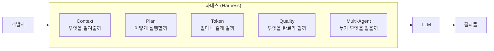
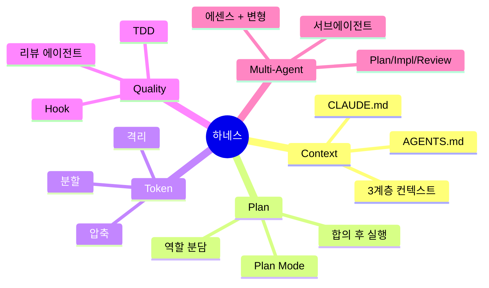

# 2.0 왜 이 5가지인가 — 하네스 엔지니어링 관점

> **Agent = Model + Harness**

## 질문: 왜 같은 모델인데 결과가 다른가

같은 Claude를 쓰는데도 누구는 30분 만에 기능을 완성하고, 누구는 두 시간째 이상한 코드와 씨름 중입니다. 모델은 동일합니다. 차이는 어디서 오는가?

답은 **하네스(harness)**입니다.

## 하네스란 무엇인가

> **하네스 = 에이전트에서 모델을 제외한 모든 것**

하네스(harness)라는 단어는 원래 말이 끄는 마구(馬具)에서 왔습니다. 말의 힘을 유용한 일로 향하게 하는 장치라는 뜻이죠. AI 에이전트 맥락에서는 — **LLM의 능력을 신뢰할 수 있는 작업 수행으로 향하게 하는 모든 인프라·규칙·도구**를 가리킵니다. 같은 모델이라도 무엇으로 감싸느냐에 따라 결과가 크게 달라집니다.

**이 강의의 Part 2는 하네스의 5가지 축을 하나씩 다룹니다.**

## "Harness Engineering"이라는 용어의 출처

이 용어를 누가 어디서 처음 정립했는지 정확히 짚고 가겠습니다. (잘못된 인용만큼 신뢰를 깎는 건 없으니까요.)

### 1차 출처: Birgitta Böckeler (Thoughtworks) — Martin Fowler 사이트

가장 권위 있는 출처는 Thoughtworks의 Distinguished Engineer **Birgitta Böckeler**가 2026년 2월 17일 Martin Fowler의 *Exploring Gen AI* 시리즈에 게재한 글 [**"Harness engineering for coding agent users"**](https://martinfowler.com/articles/exploring-gen-ai/harness-engineering.html)입니다.

이 글에서 Böckeler는 다음과 같이 정의합니다:

> **"Agent = Model + Harness"**
>
> 하네스는 AI 에이전트에서 모델을 제외한 모든 것 — 사양, 품질 검사, 워크플로 가이던스를 통제하는 장치들의 묶음.

그리고 핵심 메시지:

> **"Harness Engineering is how humans work on the loop."**
>
> (사람은 루프 *안에서* 일하는 게 아니라, 루프 *위에서* 일한다 — 그 도구가 하네스 엔지니어링이다.)

### 동시기의 다른 흐름

이 용어는 한 사람이 단독으로 만든 게 아니라, **2026년 초에 여러 곳에서 동시에 성숙한 개념**입니다. 출처를 정직하게 분산해 두는 게 정확합니다.

- **HumanLayer (Dexter Horthy 외)** — [Skill Issue: Harness Engineering for Coding Agents](https://www.humanlayer.dev/blog/skill-issue-harness-engineering-for-coding-agents). 이 글은 "에이전트가 실수할 때마다 그 실수를 다시는 안 하게 만드는 엔지니어링"으로 정의합니다.
- **OpenAI Codex 팀** — 대규모 프로덕션 코드베이스에 적용하면서 "harness engineering"을 자체적으로 정착시킨 사례가 [InfoQ에서 보도](https://www.infoq.com/news/2026/02/openai-harness-engineering-codex/)되었습니다.
- 그 외에도 Mitchell Hashimoto 등 여러 실무자가 비슷한 시기에 "agent harness" 개념을 글·강연으로 다루며 공통 감각이 형성됐습니다.

### Andrej Karpathy의 기여 — 정확히 어디까지인가

오해를 피하기 위해 Karpathy의 기여를 정확히 분리해 둡니다.

- ✅ Karpathy는 2026년 3월 [autoresearch](https://github.com/karpathy/autoresearch)에서 **"execution harness"** 라는 개념을 사용했습니다 — 다만 이는 *evaluation harness*에 가까운 좁은 의미입니다.
- ✅ Karpathy는 "**Context Engineering**"의 자주 인용되는 정의를 남겼습니다: *"the delicate art and science of filling the context window with just the right information for the next step."*
- ✅ Karpathy는 2026년 초 "vibe coding은 끝났다, 다음은 **Agentic Engineering**"이라고 선언했습니다.
- ❌ 다만 **"Harness Engineering"이라는 용어 자체는 Karpathy가 코인한 것이 아닙니다.** 그는 같은 흐름의 다른 진영에서 영향을 준 인물입니다.

### 이 강의에서의 프레이밍

이 강의는 위의 흐름을 따라 **"Harness Engineering"** 이라는 묶음을 채택했습니다. 단, **5가지 축(Context · Plan · Token · Quality · Multi-Agent)으로 정리한 분류 자체는 이 강의의 프레이밍**입니다. Böckeler의 원 글은 다른 분류(컨텍스트 엔지니어링·아키텍처 제약·가비지 컬렉션 에이전트)를 사용합니다. 둘 다 같은 산을 다른 길로 오르는 것이라 보시면 됩니다.

### Anthropic Claude Code의 설계 방향

Claude Code가 제공하는 기본 블록 — CLAUDE.md, Plan Mode, 서브에이전트, 훅(Hook) — 은 결국 **개발자가 자신의 하네스를 구축할 수 있도록 돕는** 도구들입니다. 이 강의의 5가지 축이 Claude Code의 기본 기능과 매끄럽게 매핑되는 이유입니다.

> **핵심 전환**: "AI에게 무엇을 시킬까"에서 "AI에게 어떤 환경을 줄까"로.

## 5가지 축의 관계

| 축 | 질문 | 핵심 개념 |
|---|---|---|
| **2.1 Context** | 에이전트는 우리 세계를 아는가? | 컨텍스트 계층, CLAUDE.md |
| **2.2 Plan** | 실행 전에 합의했는가? | Plan Mode, 역할 분담 |
| **2.3 Token** | 길게 일할 수 있는가? | 압축, 분할, 서브에이전트 |
| **2.4 Quality** | "완료"가 검증 가능한가? | TDD, 훅, 리뷰 에이전트 |
| **2.5 Multi-Agent** | 역할이 분리돼 있는가? | Plan/Impl/Review 분리 |

이 5가지는 **순서가 아니라 축**입니다. 동시에 존재해야 하네스가 제대로 작동합니다. 하나라도 빠지면 금방 무너집니다.

- 컨텍스트 없는 플랜 = 엉뚱한 계획
- 플랜 없는 실행 = 안티패턴 1번 (Part 1.1 사례)
- 검증 없는 완료 = "작동하는 것처럼 보이는 코드"
- 단일 에이전트에 모든 걸 몰기 = 컨텍스트 오염

## 이 강의에서 얻어갈 것

강의 마지막에 여러분이 팀에 가져갈 수 있는 건 "새로운 프롬프트 10개"가 아닙니다. **여러분만의 하네스를 시작할 수 있는 5가지 체크포인트**입니다.

Part 2의 각 챕터 끝에는 💼 현장 사례와 🛠️ 미니 실습이 붙어 있습니다. 원칙 → 실습 → 사례의 순서로 따라오시면 됩니다.
