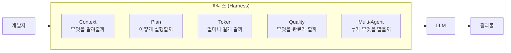

# 2.0 왜 이 5가지인가 — 하네스 엔지니어링 관점

> "모델이 아니라, 모델을 감싼 하네스(harness)가 성능을 결정한다."

## 질문: 왜 같은 모델인데 결과가 다른가

같은 Claude Sonnet 4.5를 쓰는데도 옆자리 동료는 30분 만에 기능을 완성하고, 나는 두 시간째 이상한 코드와 씨름 중입니다. 모델은 동일합니다. 차이는 어디서 오는가?

답은 **하네스(harness)**입니다.

## 하네스란 무엇인가

하네스는 LLM을 감싸는 모든 것입니다. 같은 모델이라도 무엇으로 감싸느냐에 따라 결과가 크게 달라집니다.

**이 강의의 Part 2는 하네스의 5가지 축을 하나씩 다룹니다.**

## 왜 지금 "하네스"인가

### Andrej Karpathy의 관찰

> "People often think that building an LLM application is about the LLM. It's actually 90% about the context and the scaffolding around the model."
>
> — Andrej Karpathy (요약)

Karpathy는 최근 여러 강연에서 "모델은 상품화되었고, 진짜 차이는 하네스에서 난다"는 점을 반복해 강조하고 있습니다.

### Anthropic의 설계 철학

Claude Code는 "좋은 하네스를 제공하는 것"을 목표로 설계됐습니다. CLAUDE.md, Plan Mode, 서브에이전트, 훅(Hook) — 이 모든 것은 개발자가 하네스를 직접 구축할 수 있게 해주는 기본 블록입니다.

> **핵심 전환**: "AI에게 무엇을 시킬까"에서 "AI에게 어떤 환경을 줄까"로.

## 5가지 축의 관계

| 축 | 질문 | 핵심 개념 |
|---|---|---|
| **2.1 Context** | 에이전트는 우리 세계를 아는가? | 컨텍스트 계층, CLAUDE.md |
| **2.2 Plan** | 실행 전에 합의했는가? | Plan Mode, 역할 분담 |
| **2.3 Token** | 길게 일할 수 있는가? | 압축, 분할, 서브에이전트 |
| **2.4 Quality** | "완료"가 검증 가능한가? | TDD, 훅, 리뷰 에이전트 |
| **2.5 Multi-Agent** | 역할이 분리돼 있는가? | Plan/Impl/Review 분리 |

이 5가지는 **순서가 아니라 축**입니다. 동시에 존재해야 하네스가 제대로 작동합니다. 하나라도 빠지면 금방 무너집니다.

- 컨텍스트 없는 플랜 = 엉뚱한 계획
- 플랜 없는 실행 = 안티패턴 1번 (1.1 강규한 사례)
- 검증 없는 완료 = "작동하는 것처럼 보이는 코드"
- 단일 에이전트에 모든 걸 몰기 = 컨텍스트 오염

## 이 강의에서 얻어갈 것

강의 마지막에 여러분이 팀에 가져갈 수 있는 건 "새로운 프롬프트 10개"가 아닙니다. **여러분만의 하네스를 시작할 수 있는 5가지 체크포인트**입니다.

Part 2의 각 챕터 끝에는 💼 현장 사례와 🛠️ 미니 실습이 붙어 있습니다. 원칙 → 실습 → 사례의 순서로 따라오시면 됩니다.
