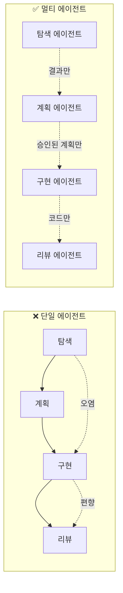
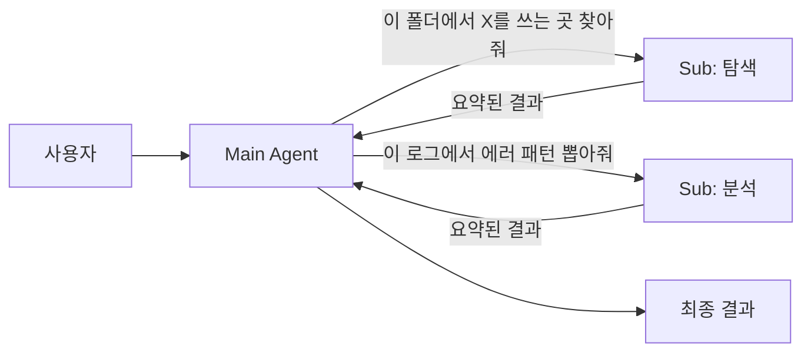
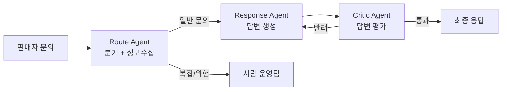

# 2.5 Multi-Agent Orchestration

> 역할을 나누는 힘

## 📚 이 장의 근거

이 장의 내용은 아래 1차 소스에 기반합니다. 본문의 원리·패턴은 이 문서들이 공통으로 말하는 것들을 정리한 것입니다.

- **Anthropic — [Effective harnesses for long-running agents](https://www.anthropic.com/engineering/effective-harnesses-for-long-running-agents)** — 긴 작업 에이전트를 **Planner · Generator · Evaluator** 3역할로 분리하는 아키텍처. "역할 분리 = 컨텍스트 분리" 원리의 1차 출처.
- **Anthropic — [How we built our multi-agent research system](https://www.anthropic.com/engineering/built-multi-agent-research-system)** — Lead-Researcher + 병렬 Sub-agent 위임 패턴. 단일 에이전트 대비 성능 향상의 정량 근거.
- **HumanLayer — [Skill Issue: Harness Engineering for Coding Agents](https://www.humanlayer.dev/blog/skill-issue-harness-engineering-for-coding-agents)** — Sub-agent를 **context firewall** 로 쓰는 설계 원칙 ("부모는 요약본만 받는다").
- **Anthropic — [Writing tools for agents](https://www.anthropic.com/engineering/writing-tools-for-agents)** — 에이전트 간 전달 인터페이스를 좁히는 베스트 프랙티스.

세 문서가 공통으로 말하는 핵심은 하나입니다: **"긴 작업일수록 한 에이전트에 맡기면 안 된다."**

## 한 명에게 다 맡기면 생기는 일

회사에서 한 사람에게 "기획·디자인·개발·QA·배포 다 해"라고 하면 어떻게 될까요? 답은 뻔합니다:
- 컨텍스트 전환 비용이 폭발
- 한 역할을 할 때 다른 역할이 방해
- 자기 작업을 자기가 검증 → 객관성 상실

AI 에이전트도 똑같습니다. 하나의 에이전트에게 "코드 탐색 + 계획 + 구현 + 리뷰 + 배포"를 다 시키면:

- **컨텍스트 오염** — 탐색할 때 쌓인 불필요한 정보가 구현 단계까지 따라옴
- **역할 혼재** — 구현하던 사고방식으로 리뷰하면 자기 코드의 문제가 안 보임
- **윈도우 고갈** — 긴 작업일수록 토큰이 금방 바닥남

## 핵심 원리: "역할 분리 = 컨텍스트 분리"



**핵심은 "전달 인터페이스를 좁히는 것"입니다.** 각 에이전트는 앞 단계의 **결과**만 받고, 과정의 잡음은 버립니다.

## 3가지 실전 패턴

### 패턴 1: Plan / Implement / Review 분리

가장 기본이자 가장 강력한 패턴입니다.

| 에이전트 | 역할 | 주는 것 | 받는 것 |
|---|---|---|---|
| **Plan Agent** | 요구사항 → 작업 계획 | 요구사항·기존 코드 | 구조화된 플랜 |
| **Implement Agent** | 계획대로 구현만 | 승인된 플랜 | 코드 변경분 |
| **Review Agent** | 독립적 검증 | 변경분 + 플랜 | 리뷰 코멘트 |

**왜 강력한가**: Review Agent가 Implement Agent의 사고 과정을 모릅니다. 그래서 **"왜 이렇게 짰는지"가 아니라 "뭐가 이상한지"** 만 봅니다. 이게 객관성입니다.

### 패턴 2: Main + 서브에이전트 (탐색·검증·요약 위임)

Main 에이전트는 전체 흐름을 지휘하고, 토큰을 많이 먹는 일(코드베이스 탐색, 긴 문서 요약, 로그 분석)은 **서브에이전트에게 격리해서** 보냅니다.



**이점**:
- 서브에이전트의 컨텍스트는 작업 후 버려짐
- Main의 윈도우는 "요약본"만 받아서 보호됨
- 병렬 탐색도 가능

이게 Part 2.3(Token Optimization)과 맞닿는 지점입니다. 토큰 절약의 가장 효과적인 방법은 **에이전트 분리**입니다.

### 패턴 3: 에센스 정의 → 변형 생성 (디자인팀 패턴)

이건 조금 색다른 패턴입니다. 아래 사례에서 자세히 보겠습니다.

## 🤖 AI Pro에서는?

AI Pro의 **Skills**가 멀티 에이전트 패턴의 핵심 도구입니다 — AI Pro 공식 안내에 *"Claude의 skills와 동일한 개념"* 이라고 명시되어 있습니다.

### Skills의 두 가지 호출 방식

1. **직접 호출** — `/skill-name` 으로 명시적 트리거. 어떤 Skill을 쓸지 이미 알 때.
2. **자동 판단** — 자연어 요청만 해도 description을 보고 자동 트리거. **description이 명확할수록 정확도 ↑**.

### Skill 폴더 구조

```
my-skill/
├── SKILL.md      (필수 — frontmatter + 본문)
├── reference.md  (참조 문서, 필요 시 로드)
├── examples.md   (예시, 필요 시 로드)
└── scripts/
    └── helper.py (실행 스크립트)
```

| 위치 | 경로 | 적용 대상 |
|---|---|---|
| Personal | `~/.aipro/skills/<skill-name>/SKILL.md` | 모든 프로젝트 |
| Project | `.aipro/skills/<skill-name>/SKILL.md` | 이 프로젝트만 |

### Frontmatter 4가지 필드

```yaml
---
name: skill-name              # 소문자/숫자/하이픈, 64자 이내
description: 언제·왜 사용하는지  # AI Pro 자동 트리거 판단의 기준 (1024자 이내)
disable-model-invocation: false  # true면 자동 호출 차단, /name 수동만
user-invocable: true            # false면 / 메뉴에서 숨김
---
```

### 멀티 에이전트 패턴을 Skills로 운영하기

| 강의의 패턴 | Skills 운영 |
|---|---|
| **Plan / Implement / Review 분리** | `plan-only`, `implement-only`, `review-only` 3개 Skill 작성, 단계별 직접 호출 |
| **Main + 서브에이전트 (탐색·검증·요약)** | `code-search`, `log-summary` 등을 Skill로 만들고 자동 트리거에 맡김 |
| **에센스 + 변형** | 공통 가이드는 Project Rules, 변형 작업은 각 Skill |

### skill-creator — 메타스킬

AI Pro는 **`skill-creator`** 빌트인 메타스킬을 제공합니다. Skill을 만드는 Skill입니다.

수행 가능한 작업:
- 새 Skill 생성·기존 Skill 개선
- 테스트 케이스 자동 생성·실행 (with-skill / baseline 비교)
- 정성(브라우저 뷰어) + 정량(assertion 벤치마크) 평가
- description 최적화 (트리거 정확도 향상)

> 이게 사실 **부록 F의 Autoresearch 패턴이 빌트인으로 들어 있는 것**과 같습니다. AI Pro 사용자는 별도 도구 없이 즉시 활용 가능합니다.

> 🛠️ **손으로 익히기**: [실습 트랙 · Step 5 — Sub-agent 위임](./hands-on-5-multi-agent)에서 단일 에이전트 vs Main+Sub의 컨텍스트 사용량 차이를 직접 측정합니다.

---

## 💼 현업 사례: 당근 — KAMP 위에서 돌아가는 중고차 경매 멀티 에이전트

국내 하이퍼로컬 서비스 [당근의 GenAI 플랫폼 KAMP](https://medium.com/daangn/%EB%8B%B9%EA%B7%BC%EC%9D%98-genai-%ED%94%8C%EB%9E%AB%ED%8F%BC-ee2ac8953046) 사례입니다. Route / Response / Critic **3개 역할로 쪼갠 에이전트**가 실제 프로덕션에서 어떤 임팩트를 내는지 숫자로 보여주는 드문 사례입니다.

### 문제

당근 중고차에서 판매자의 문의가 팀으로 쏟아지는 상황:

- "어떻게 팔아요?", "경매는 어떻게 돌아가요?" 같은 **반복 문의**가 운영팀에 집중됨
- 단일 LLM 하나로 답하면 — 엉뚱한 케이스에서 자신 있게 틀림(hallucination), 운영팀이 매번 사후 수습
- "분기 판단 → 답변 생성 → 답변 검증"을 한 모델에 시키면 자기 답을 자기가 검증 → 객관성 상실

### 해결: Route / Response / Critic 3-에이전트

당근은 사내 GenAI 플랫폼 **KAMP** 위에서, 중고차 경매 에이전트를 **3개 역할로 분리**해 올렸습니다.



핵심 설계:

1. **Route Agent** — 문의 유형을 판단해 사람에게 넘길지 Response로 넘길지 결정. 중고차 팀의 **MCP 서버·세션 메모리·KAMP API**를 써서 맥락을 수집
2. **Response Agent** — Route가 정리한 맥락만 받고 답변 생성 (**컨텍스트가 좁혀진 상태**)
3. **Critic Agent** — Response의 답변을 **독립된 시선으로 평가**한 뒤 최종 출력. 자기 답을 자기가 검증하지 않음
4. **역할 분리 = 컨텍스트 분리** — 분기·답변·검증이 같은 세션에 섞이지 않음

### 정량 임팩트

에이전트 도입 전후 운영팀이 체감한 변화:

- **일당 평균 문의 수 56% 감소**
- **피크일 문의 수 72% 감소**
- KAMP 위에서 만들어진 에이전트가 **26개**까지 확장, 에이전트 생성 기간이 **2개월 → 15일**(평가 포함)로 단축

> **단일 모델을 3개 역할로 쪼갠 것만으로 운영 부하가 절반 이하.**

### 핵심 인사이트

이 사례가 보여주는 건 **강의의 5가지 원칙이 실제로 합류하는 지점**입니다:

- **Context** — Route가 맥락을 정제한 뒤 Response에 넘김
- **Plan** — Route Agent 자체가 "어떤 답변 경로로 갈지" 계획하는 역할
- **Quality** — Critic Agent가 독립 검증
- **Token** — 각 에이전트의 컨텍스트가 좁아 윈도우 보호
- **Multi-Agent** — 위 4가지가 동시에 작동

> **"한 모델에게 다 시키지 않고, 역할을 나눠서 서로의 결과를 다시 보게 한다."**

이게 Part 2.5 도입부의 *"역할 분리 = 컨텍스트 분리"* 와 정확히 같은 원리입니다. 사람 조직에서 기획·실행·검토가 분리되어야 품질이 나오는 것과 똑같습니다.

> 출처: [당근의 GenAI 플랫폼 KAMP](https://medium.com/daangn/%EB%8B%B9%EA%B7%BC%EC%9D%98-genai-%ED%94%8C%EB%9E%AB%ED%8F%BC-ee2ac8953046) — 당근 테크 블로그 · [당근이 AI 에이전트 활용하는 법](https://byline.network/2025/11/25_danggn-2/) — 바이라인네트워크

### 여러분 팀에 옮긴다면

| 단계 | 무엇 |
|---|---|
| **1단계** | "한 모델에게 다 시키고 있는 운영 업무" 1개 고르기 (예: 고객 문의 응답, 컨텐츠 모더레이션, 이상 거래 탐지) |
| **2단계** | 그 작업을 **Route → Response → Critic** 세 역할로 쪼개기 |
| **3단계** | Route 단계에서 **사람에게 에스컬레이션 할 케이스**를 명확히 정의 (전부 자동화하려 하지 말 것) |
| **4단계** | Critic이 반려하면 Response가 다시 생성하는 루프를 만들되, **최대 반복 횟수 제한** |

이게 **Part 2.4 Quality Verification**(독립된 검토 에이전트)과 **Part 2.5 Multi-Agent Orchestration**이 합류하는 지점입니다 — 둘은 사실 같은 패턴의 두 측면입니다.

## 정리: 5가지 토픽이 합류하는 지점

흥미롭게도 멀티 에이전트는 **앞의 4가지 토픽이 모두 모이는 지점**입니다.

- **Context** (2.1) 없이는 에센스가 없음 → 일관성 깨짐
- **Plan** (2.2) 없이는 역할 분담이 안 됨
- **Token** (2.3) 문제는 멀티 에이전트로 해결됨
- **Quality** (2.4) 는 Review Agent로 구조화됨
- **Multi-Agent** (2.5) = 위 4가지가 동시에 작동하는 형태

**멀티 에이전트는 별도 기술이 아닙니다. 하네스가 잘 만들어져 있을 때 자연스럽게 도달하는 형태입니다.**

## 여러분 팀에서 시작하는 법

당장 Plan/Impl/Review 3개 에이전트를 띄우라는 얘기가 아닙니다. 질문 하나부터 시작하세요:

> **"지금 하나의 에이전트에게 시키고 있는 일 중에, 서로 다른 역할이 섞여 있는 건 뭔가?"**

그 하나를 둘로 분리하는 것 — 멀티 에이전트의 첫 걸음입니다.
