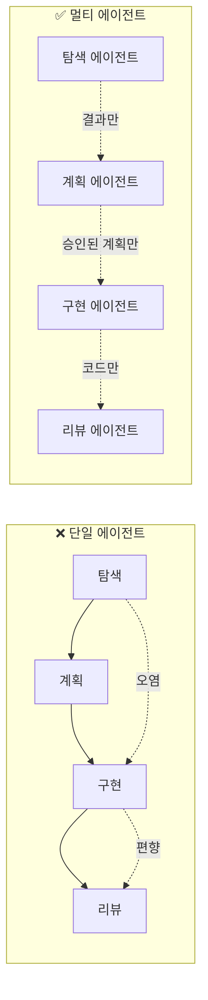
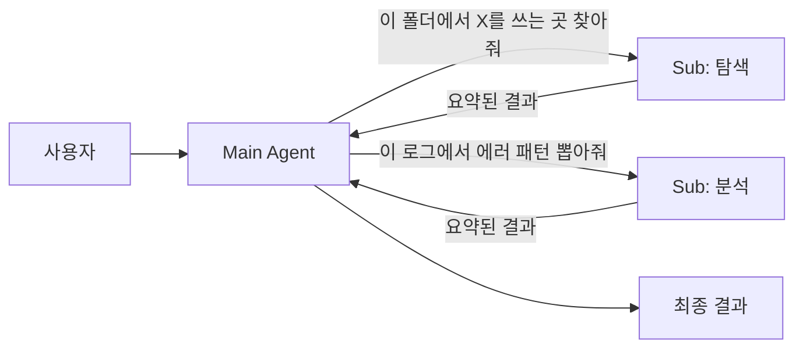
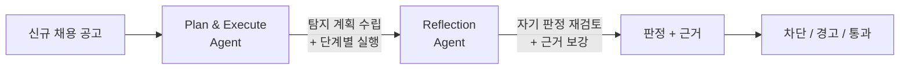

# 2.5 Multi-Agent Orchestration

> 역할을 나누는 힘

## 한 명에게 다 맡기면 생기는 일

회사에서 한 사람에게 "기획·디자인·개발·QA·배포 다 해"라고 하면 어떻게 될까요? 답은 뻔합니다:
- 컨텍스트 전환 비용이 폭발
- 한 역할을 할 때 다른 역할이 방해
- 자기 작업을 자기가 검증 → 객관성 상실

AI 에이전트도 똑같습니다. 하나의 에이전트에게 "코드 탐색 + 계획 + 구현 + 리뷰 + 배포"를 다 시키면:

- **컨텍스트 오염** — 탐색할 때 쌓인 불필요한 정보가 구현 단계까지 따라옴
- **역할 혼재** — 구현하던 사고방식으로 리뷰하면 자기 코드의 문제가 안 보임
- **윈도우 고갈** — 긴 작업일수록 토큰이 금방 바닥남

## 핵심 원리: "역할 분리 = 컨텍스트 분리"



**핵심은 "전달 인터페이스를 좁히는 것"입니다.** 각 에이전트는 앞 단계의 **결과**만 받고, 과정의 잡음은 버립니다.

## 3가지 실전 패턴

### 패턴 1: Plan / Implement / Review 분리

가장 기본이자 가장 강력한 패턴입니다.

| 에이전트 | 역할 | 주는 것 | 받는 것 |
|---|---|---|---|
| **Plan Agent** | 요구사항 → 작업 계획 | 요구사항·기존 코드 | 구조화된 플랜 |
| **Implement Agent** | 계획대로 구현만 | 승인된 플랜 | 코드 변경분 |
| **Review Agent** | 독립적 검증 | 변경분 + 플랜 | 리뷰 코멘트 |

**왜 강력한가**: Review Agent가 Implement Agent의 사고 과정을 모릅니다. 그래서 **"왜 이렇게 짰는지"가 아니라 "뭐가 이상한지"** 만 봅니다. 이게 객관성입니다.

### 패턴 2: Main + 서브에이전트 (탐색·검증·요약 위임)

Main 에이전트는 전체 흐름을 지휘하고, 토큰을 많이 먹는 일(코드베이스 탐색, 긴 문서 요약, 로그 분석)은 **서브에이전트에게 격리해서** 보냅니다.



**이점**:
- 서브에이전트의 컨텍스트는 작업 후 버려짐
- Main의 윈도우는 "요약본"만 받아서 보호됨
- 병렬 탐색도 가능

이게 Part 2.3(Token Optimization)과 맞닿는 지점입니다. 토큰 절약의 가장 효과적인 방법은 **에이전트 분리**입니다.

### 패턴 3: 에센스 정의 → 변형 생성 (디자인팀 패턴)

이건 조금 색다른 패턴입니다. 아래 사례에서 자세히 보겠습니다.

## 🤖 AI Pro에서는?

AI Pro의 **Skills**가 멀티 에이전트 패턴의 핵심 도구입니다 — AI Pro 공식 안내에 *"Claude의 skills와 동일한 개념"* 이라고 명시되어 있습니다.

### Skills의 두 가지 호출 방식

1. **직접 호출** — `/skill-name` 으로 명시적 트리거. 어떤 Skill을 쓸지 이미 알 때.
2. **자동 판단** — 자연어 요청만 해도 description을 보고 자동 트리거. **description이 명확할수록 정확도 ↑**.

### Skill 폴더 구조

```
my-skill/
├── SKILL.md      (필수 — frontmatter + 본문)
├── reference.md  (참조 문서, 필요 시 로드)
├── examples.md   (예시, 필요 시 로드)
└── scripts/
    └── helper.py (실행 스크립트)
```

| 위치 | 경로 | 적용 대상 |
|---|---|---|
| Personal | `~/.aipro/skills/<skill-name>/SKILL.md` | 모든 프로젝트 |
| Project | `.aipro/skills/<skill-name>/SKILL.md` | 이 프로젝트만 |

### Frontmatter 4가지 필드

```yaml
---
name: skill-name              # 소문자/숫자/하이픈, 64자 이내
description: 언제·왜 사용하는지  # AI Pro 자동 트리거 판단의 기준 (1024자 이내)
disable-model-invocation: false  # true면 자동 호출 차단, /name 수동만
user-invocable: true            # false면 / 메뉴에서 숨김
---
```

### 멀티 에이전트 패턴을 Skills로 운영하기

| 강의의 패턴 | Skills 운영 |
|---|---|
| **Plan / Implement / Review 분리** | `plan-only`, `implement-only`, `review-only` 3개 Skill 작성, 단계별 직접 호출 |
| **Main + 서브에이전트 (탐색·검증·요약)** | `code-search`, `log-summary` 등을 Skill로 만들고 자동 트리거에 맡김 |
| **에센스 + 변형** | 공통 가이드는 Project Rules, 변형 작업은 각 Skill |

### skill-creator — 메타스킬

AI Pro는 **`skill-creator`** 빌트인 메타스킬을 제공합니다. Skill을 만드는 Skill입니다.

수행 가능한 작업:
- 새 Skill 생성·기존 Skill 개선
- 테스트 케이스 자동 생성·실행 (with-skill / baseline 비교)
- 정성(브라우저 뷰어) + 정량(assertion 벤치마크) 평가
- description 최적화 (트리거 정확도 향상)

> 이게 사실 **부록 F의 Autoresearch 패턴이 빌트인으로 들어 있는 것**과 같습니다. AI Pro 사용자는 별도 도구 없이 즉시 활용 가능합니다.

## 🛠️ 미니 실습 (3분)

> **실습 저장소**: [autoresearch-harness-steps/step-5-multi-agent](https://github.com/imakerjun/autoresearch-harness-steps/tree/master/harness-steps/step-5-multi-agent) — `train.py`의 hyperparameter 탐색을 서브에이전트로 위임 (context firewall 패턴).

**과제**: 프로젝트에서 `TODO` 주석을 모두 찾아 우선순위별로 분류하기.

### 나쁜 방식 (단일 에이전트)

"프로젝트에서 TODO 찾고 우선순위 매기고 정리해줘"
→ 수백 개 파일을 Main이 직접 읽음 → 윈도우 고갈 → 작업 중단

### 좋은 방식 (Main + 서브)

Main에게:
> "서브에이전트로 코드베이스에서 TODO 주석을 모두 찾고, 파일 경로와 내용만 리스트로 돌려받아. 그 다음 네가 우선순위를 매겨."

Main → Sub(탐색) → 요약된 리스트 → Main(판단) → 결과

두 방식을 실제로 돌려보면, Main의 컨텍스트 사용량이 크게 다릅니다.

---

## 💼 현업 사례: 잡코리아 — 불량공고 탐지 멀티 에이전트 시스템(FJDS)

국내 커리어 플랫폼 [잡코리아 기술팀이 2026년 공개한 'LOOP 에이전트 개발기' 시리즈](https://techblog.jobkorea.co.kr/jobkorea-loop-%EC%97%90%EC%9D%B4%EC%A0%84%ED%8A%B8-%EA%B0%9C%EB%B0%9C%EA%B8%B0-6-%EB%A9%80%ED%8B%B0%EC%97%90%EC%9D%B4%EC%A0%84%ED%8A%B8%EC%8B%9C%EC%8A%A4%ED%85%9C%EC%9D%84-%EC%9C%84%ED%95%9C-%EC%95%88%EB%82%B4%EC%84%9C-%EC%8B%A4%EC%A0%84%ED%8E%B8-abb0a2bf86e5)입니다. 도메인이 다르지만 **"역할 분리 = 컨텍스트 분리"** 원리가 실제 프로덕션에서 어떻게 작동하는지 잘 보여줍니다.

### 문제

채용 플랫폼에 올라오는 공고 중에는 취업 사기·허위 모집 같은 **불량 공고**가 섞여 있습니다. 특히 캄보디아발 취업 사기가 사회 문제로 번지면서, 잡코리아·알바몬은 이를 **실시간으로 걸러내야 하는 상황**에 놓였습니다.

- 단일 LLM 하나로 "이 공고가 불량인지" 판정 → 판정 근거가 얕고, 오탐/미탐이 많음
- 룰 기반 필터만으로는 **문맥 속 미묘한 사기 패턴**을 못 잡음
- "탐지 → 판단 → 근거 설명 → 조치" 모두를 한 모델에 시키면 한 단계가 다른 단계를 오염시킴

### 해결: FJDS (Fraudulent Job Detection System)

잡코리아 팀의 접근은 **두 가지 어젠틱 패턴을 조합한 멀티 에이전트 시스템**이었습니다.



핵심 설계:

1. **Plan & Execute 에이전트** — 공고를 훑고 "어떤 관점에서 검증할지"(연락처·급여·문구·외부 링크 등)를 먼저 계획한 뒤, 단계별로 실행
2. **Reflection 에이전트** — 1단계 판정을 **독립된 시선**으로 다시 본다. "이 판정의 근거가 충분한가? 놓친 패턴은 없는가?"
3. **역할 분리** — 탐지하는 에이전트와 검토하는 에이전트의 컨텍스트가 섞이지 않도록 격리
4. **근거 있는 판정** — 최종 출력은 단순 라벨이 아니라 **"왜 그렇게 판단했는지"** 가 함께 나오는 구조

### 핵심 인사이트

이 사례가 보여주는 건 **강의의 5가지 원칙이 실제로 합류하는 지점**입니다:

- **Context** — 공고별 에센스만 각 에이전트에 전달
- **Plan** — Plan & Execute 에이전트가 탐지 계획부터 세움
- **Quality** — Reflection 에이전트가 독립 검증
- **Multi-Agent** — 두 패턴을 조합해서 한 모델의 한계를 넘김

> **"한 모델에게 다 시키지 않고, 역할을 나눠서 서로의 결과를 다시 보게 한다."**

이게 Part 2.5 도입부의 *"역할 분리 = 컨텍스트 분리"* 와 정확히 같은 원리입니다. 사람 조직에서 기획·실행·검토가 분리되어야 품질이 나오는 것과 똑같습니다.

> 출처: [잡코리아 LOOP 에이전트 개발기 (5) 이론편](https://techblog.jobkorea.co.kr/jobkorea-loop-%EC%97%90%EC%9D%B4%EC%A0%84%ED%8A%B8-%EA%B0%9C%EB%B0%9C%EA%B8%B0-5-%EB%A9%80%ED%8B%B0%EC%97%90%EC%9D%B4%EC%A0%84%ED%8A%B8%EC%8B%9C%EC%8A%A4%ED%85%9C%EC%9D%84-%EC%9C%84%ED%95%9C-%EC%95%88%EB%82%B4%EC%84%9C-%EC%9D%B4%EB%A1%A0%ED%8E%B8-2357858b3da4) · [(6) 실전편](https://techblog.jobkorea.co.kr/jobkorea-loop-%EC%97%90%EC%9D%B4%EC%A0%84%ED%8A%B8-%EA%B0%9C%EB%B0%9C%EA%B8%B0-6-%EB%A9%80%ED%8B%B0%EC%97%90%EC%9D%B4%EC%A0%84%ED%8A%B8%EC%8B%9C%EC%8A%A4%ED%85%9C%EC%9D%84-%EC%9C%84%ED%95%9C-%EC%95%88%EB%82%B4%EC%84%9C-%EC%8B%A4%EC%A0%84%ED%8E%B8-abb0a2bf86e5) — 잡코리아 기술 블로그 (2026)

### 여러분 팀에 옮긴다면

| 단계 | 무엇 |
|---|---|
| **1단계** | "한 모델에게 다 시키고 있는 판정 작업" 1개 고르기 (예: 컨텐츠 모더레이션, 이상 거래 탐지, 스팸 필터) |
| **2단계** | 그 작업을 **Plan → Execute → Reflect** 세 역할로 쪼개기 |
| **3단계** | Reflection 단계에서는 **1차 결과의 근거**만 받고, 원본 입력을 독립적으로 재검토 |
| **4단계** | 최종 출력에 **"판정 + 근거"** 를 함께 담아 감사·디버깅이 되도록 설계 |

이게 **Part 2.4 Quality Verification**(독립된 검토 에이전트)과 **Part 2.5 Multi-Agent Orchestration**이 합류하는 지점입니다 — 둘은 사실 같은 패턴의 두 측면입니다.

## 정리: 5가지 토픽이 합류하는 지점

흥미롭게도 멀티 에이전트는 **앞의 4가지 토픽이 모두 모이는 지점**입니다.

- **Context** (2.1) 없이는 에센스가 없음 → 일관성 깨짐
- **Plan** (2.2) 없이는 역할 분담이 안 됨
- **Token** (2.3) 문제는 멀티 에이전트로 해결됨
- **Quality** (2.4) 는 Review Agent로 구조화됨
- **Multi-Agent** (2.5) = 위 4가지가 동시에 작동하는 형태

**멀티 에이전트는 별도 기술이 아닙니다. 하네스가 잘 만들어져 있을 때 자연스럽게 도달하는 형태입니다.**

## 여러분 팀에서 시작하는 법

당장 Plan/Impl/Review 3개 에이전트를 띄우라는 얘기가 아닙니다. 질문 하나부터 시작하세요:

> **"지금 하나의 에이전트에게 시키고 있는 일 중에, 서로 다른 역할이 섞여 있는 건 뭔가?"**

그 하나를 둘로 분리하는 것 — 멀티 에이전트의 첫 걸음입니다.
