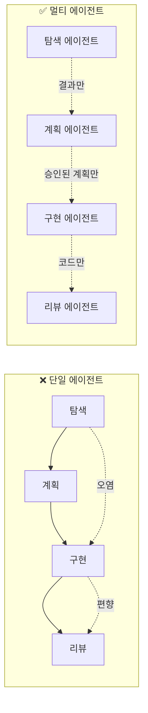
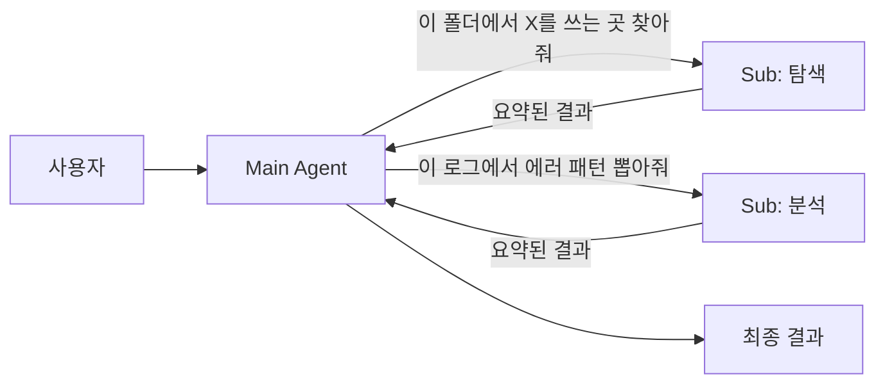
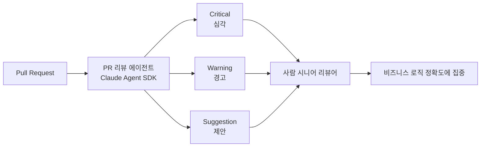

# 2.5 Multi-Agent Orchestration

> 역할을 나누는 힘

## 한 명에게 다 맡기면 생기는 일

회사에서 한 사람에게 "기획·디자인·개발·QA·배포 다 해"라고 하면 어떻게 될까요? 답은 뻔합니다:
- 컨텍스트 전환 비용이 폭발
- 한 역할을 할 때 다른 역할이 방해
- 자기 작업을 자기가 검증 → 객관성 상실

AI 에이전트도 똑같습니다. 하나의 에이전트에게 "코드 탐색 + 계획 + 구현 + 리뷰 + 배포"를 다 시키면:

- **컨텍스트 오염** — 탐색할 때 쌓인 불필요한 정보가 구현 단계까지 따라옴
- **역할 혼재** — 구현하던 사고방식으로 리뷰하면 자기 코드의 문제가 안 보임
- **윈도우 고갈** — 긴 작업일수록 토큰이 금방 바닥남

## 핵심 원리: "역할 분리 = 컨텍스트 분리"



**핵심은 "전달 인터페이스를 좁히는 것"입니다.** 각 에이전트는 앞 단계의 **결과**만 받고, 과정의 잡음은 버립니다.

## 3가지 실전 패턴

### 패턴 1: Plan / Implement / Review 분리

가장 기본이자 가장 강력한 패턴입니다.

| 에이전트 | 역할 | 주는 것 | 받는 것 |
|---|---|---|---|
| **Plan Agent** | 요구사항 → 작업 계획 | 요구사항·기존 코드 | 구조화된 플랜 |
| **Implement Agent** | 계획대로 구현만 | 승인된 플랜 | 코드 변경분 |
| **Review Agent** | 독립적 검증 | 변경분 + 플랜 | 리뷰 코멘트 |

**왜 강력한가**: Review Agent가 Implement Agent의 사고 과정을 모릅니다. 그래서 **"왜 이렇게 짰는지"가 아니라 "뭐가 이상한지"** 만 봅니다. 이게 객관성입니다.

### 패턴 2: Main + 서브에이전트 (탐색·검증·요약 위임)

Main 에이전트는 전체 흐름을 지휘하고, 토큰을 많이 먹는 일(코드베이스 탐색, 긴 문서 요약, 로그 분석)은 **서브에이전트에게 격리해서** 보냅니다.



**이점**:
- 서브에이전트의 컨텍스트는 작업 후 버려짐
- Main의 윈도우는 "요약본"만 받아서 보호됨
- 병렬 탐색도 가능

이게 Part 2.3(Token Optimization)과 맞닿는 지점입니다. 토큰 절약의 가장 효과적인 방법은 **에이전트 분리**입니다.

### 패턴 3: 에센스 정의 → 변형 생성 (디자인팀 패턴)

이건 조금 색다른 패턴입니다. 아래 사례에서 자세히 보겠습니다.

## 🤖 AI Pro에서는?

AI Pro의 **Skills**가 멀티 에이전트 패턴의 핵심 도구입니다 — AI Pro 공식 안내에 *"Claude의 skills와 동일한 개념"* 이라고 명시되어 있습니다.

### Skills의 두 가지 호출 방식

1. **직접 호출** — `/skill-name` 으로 명시적 트리거. 어떤 Skill을 쓸지 이미 알 때.
2. **자동 판단** — 자연어 요청만 해도 description을 보고 자동 트리거. **description이 명확할수록 정확도 ↑**.

### Skill 폴더 구조

```
my-skill/
├── SKILL.md      (필수 — frontmatter + 본문)
├── reference.md  (참조 문서, 필요 시 로드)
├── examples.md   (예시, 필요 시 로드)
└── scripts/
    └── helper.py (실행 스크립트)
```

| 위치 | 경로 | 적용 대상 |
|---|---|---|
| Personal | `~/.aipro/skills/<skill-name>/SKILL.md` | 모든 프로젝트 |
| Project | `.aipro/skills/<skill-name>/SKILL.md` | 이 프로젝트만 |

### Frontmatter 4가지 필드

```yaml
---
name: skill-name              # 소문자/숫자/하이픈, 64자 이내
description: 언제·왜 사용하는지  # AI Pro 자동 트리거 판단의 기준 (1024자 이내)
disable-model-invocation: false  # true면 자동 호출 차단, /name 수동만
user-invocable: true            # false면 / 메뉴에서 숨김
---
```

### 멀티 에이전트 패턴을 Skills로 운영하기

| 강의의 패턴 | Skills 운영 |
|---|---|
| **Plan / Implement / Review 분리** | `plan-only`, `implement-only`, `review-only` 3개 Skill 작성, 단계별 직접 호출 |
| **Main + 서브에이전트 (탐색·검증·요약)** | `code-search`, `log-summary` 등을 Skill로 만들고 자동 트리거에 맡김 |
| **에센스 + 변형** | 공통 가이드는 Project Rules, 변형 작업은 각 Skill |

### skill-creator — 메타스킬

AI Pro는 **`skill-creator`** 빌트인 메타스킬을 제공합니다. Skill을 만드는 Skill입니다.

수행 가능한 작업:
- 새 Skill 생성·기존 Skill 개선
- 테스트 케이스 자동 생성·실행 (with-skill / baseline 비교)
- 정성(브라우저 뷰어) + 정량(assertion 벤치마크) 평가
- description 최적화 (트리거 정확도 향상)

> 이게 사실 **부록 F의 Autoresearch 패턴이 빌트인으로 들어 있는 것**과 같습니다. AI Pro 사용자는 별도 도구 없이 즉시 활용 가능합니다.

## 🛠️ 미니 실습 (3분)

> **실습 저장소**: [steps/step-5-multi-agent/](https://github.com/imakerjun/agentic-coding-sample/tree/main/steps/step-5-multi-agent) — TODO 주석이 흩어진 작은 코드베이스. Main 단독 vs 서브에이전트 격리를 비교할 수 있습니다.

**과제**: 프로젝트에서 `TODO` 주석을 모두 찾아 우선순위별로 분류하기.

### 나쁜 방식 (단일 에이전트)

"프로젝트에서 TODO 찾고 우선순위 매기고 정리해줘"
→ 수백 개 파일을 Main이 직접 읽음 → 윈도우 고갈 → 작업 중단

### 좋은 방식 (Main + 서브)

Main에게:
> "서브에이전트로 코드베이스에서 TODO 주석을 모두 찾고, 파일 경로와 내용만 리스트로 돌려받아. 그 다음 네가 우선순위를 매겨."

Main → Sub(탐색) → 요약된 리스트 → Main(판단) → 결과

두 방식을 실제로 돌려보면, Main의 컨텍스트 사용량이 크게 다릅니다.

---

## 💼 현장 사례: 하이퍼리즘 — PR 리뷰 에이전트로 시니어 병목 해소

핀테크 회사 [하이퍼리즘(Hyperithm)의 기술팀이 공개한 사례](https://tech.hyperithm.com/review-agent)입니다. 멀티 에이전트의 가장 대표적인 실무 적용 패턴 — **"리뷰 에이전트로 사람 시니어를 보호하는 것"** 을 정확히 보여줍니다.

### 문제

도메인 지식과 정확도가 핵심인 핀테크 코드베이스에서 흔한 풍경:

- 시니어 개발자에게 **코드 리뷰 요청이 집중**됨
- 명백한 실수·로직 오류·코딩 스타일 같은 1차 이슈로 시니어 시간이 소모됨
- 리뷰 대기가 길어지면서 **개발이 정체**됨
- 정작 시니어가 봐야 할 **비즈니스 로직 정확도** 검토에 집중할 시간이 부족

> **시니어 개발자가 병목이 되는 구조 — 모든 회사가 겪는 문제입니다.**

### 해결

하이퍼리즘 팀의 접근:



핵심 설계:

1. **자동화된 1차 리뷰** — PR이 시니어에게 가기 전에 에이전트가 먼저 봄
2. **3단계 분류** — Critical / Warning / Suggestion으로 명확히 나눠 출력
3. **관점 명시** — 보안·성능·가독성 중심으로 구체적 개선 방안 제시
4. **시니어 보호** — 명백한 이슈가 1차에서 걸러지면, 시니어는 **비즈니스 로직 정확도** 검토에만 집중 가능

### 기술적 선택

- **Claude Agent SDK** 사용 — 설치된 Claude Code를 Python/TypeScript로 제어할 수 있는 라이브러리
- 다른 에이전트 개발 패키지들과 비교 후 선택

### 핵심 인사이트

이 사례는 **멀티 에이전트의 가장 본질적인 패턴**을 보여줍니다:

> **"AI 에이전트는 시니어를 대체하는 것이 아니라, 시니어가 진짜 가치 있는 일에 집중할 수 있도록 보호하는 도구다."**

이게 Part 2.5 도입부의 *"역할 분리 = 컨텍스트 분리"* 와 정확히 같은 원리입니다. 사람도 컨텍스트가 분리되어야 자기 전문성에 집중할 수 있습니다.

> 출처: [PR 리뷰 에이전트 개발기 feat. Claude Agent SDK](https://tech.hyperithm.com/review-agent) — 하이퍼리즘 기술 블로그

### 여러분 팀에 옮긴다면

| 단계 | 무엇 |
|---|---|
| **1단계** | 시니어 시간을 가장 많이 잡아먹는 1차 이슈 종류 3가지 식별 (예: 컨벤션 위반, 명백한 null 처리 누락, 잘못된 import) |
| **2단계** | 그 3가지를 잡는 1차 리뷰 에이전트 작성 (Claude Code 서브에이전트 또는 GitHub Action) |
| **3단계** | Critical / Warning / Suggestion 3단계 분류로 출력 |
| **4단계** | 시니어 리뷰어는 그 결과 위에서 **비즈니스 로직만** 집중 검토 |

이게 **Part 2.4 Quality Verification**(독립된 리뷰 에이전트)과 **Part 2.5 Multi-Agent Orchestration**이 합류하는 지점입니다 — 둘은 사실 같은 패턴의 두 측면입니다.

## 정리: 5가지 토픽이 합류하는 지점

흥미롭게도 멀티 에이전트는 **앞의 4가지 토픽이 모두 모이는 지점**입니다.

- **Context** (2.1) 없이는 에센스가 없음 → 일관성 깨짐
- **Plan** (2.2) 없이는 역할 분담이 안 됨
- **Token** (2.3) 문제는 멀티 에이전트로 해결됨
- **Quality** (2.4) 는 Review Agent로 구조화됨
- **Multi-Agent** (2.5) = 위 4가지가 동시에 작동하는 형태

**멀티 에이전트는 별도 기술이 아닙니다. 하네스가 잘 만들어져 있을 때 자연스럽게 도달하는 형태입니다.**

## 여러분 팀에서 시작하는 법

당장 Plan/Impl/Review 3개 에이전트를 띄우라는 얘기가 아닙니다. 질문 하나부터 시작하세요:

> **"지금 하나의 에이전트에게 시키고 있는 일 중에, 서로 다른 역할이 섞여 있는 건 뭔가?"**

그 하나를 둘로 분리하는 것 — 멀티 에이전트의 첫 걸음입니다.
