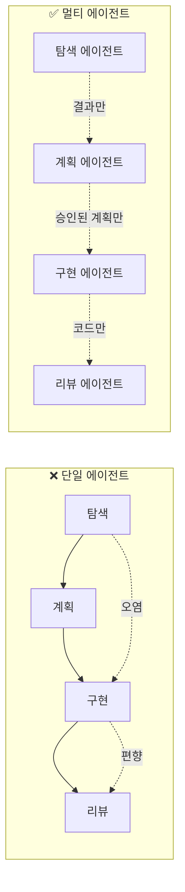
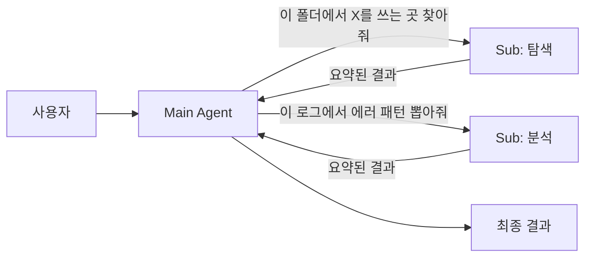
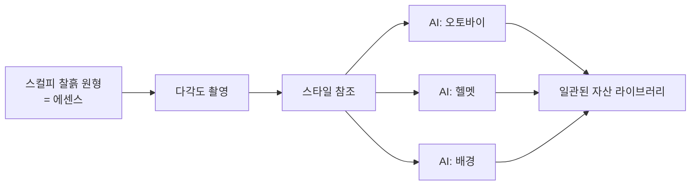

# 2.5 Multi-Agent Orchestration — 멀티 에이전트 활용

> 역할을 나누는 힘

## 한 명에게 다 맡기면 생기는 일

회사에서 한 사람에게 "기획·디자인·개발·QA·배포 다 해"라고 하면 어떻게 될까요? 답은 뻔합니다:
- 컨텍스트 전환 비용이 폭발
- 한 역할을 할 때 다른 역할이 방해
- 자기 작업을 자기가 검증 → 객관성 상실

AI 에이전트도 똑같습니다. 하나의 에이전트에게 "코드 탐색 + 계획 + 구현 + 리뷰 + 배포"를 다 시키면:

- **컨텍스트 오염** — 탐색할 때 쌓인 불필요한 정보가 구현 단계까지 따라옴
- **역할 혼재** — 구현하던 사고방식으로 리뷰하면 자기 코드의 문제가 안 보임
- **윈도우 고갈** — 긴 작업일수록 토큰이 금방 바닥남

## 핵심 원리: "역할 분리 = 컨텍스트 분리"

**핵심은 "전달 인터페이스를 좁히는 것"입니다.** 각 에이전트는 앞 단계의 **결과**만 받고, 과정의 잡음은 버립니다.

## 3가지 실전 패턴

### 패턴 1: Plan / Implement / Review 분리

가장 기본이자 가장 강력한 패턴입니다.

| 에이전트 | 역할 | 주는 것 | 받는 것 |
|---|---|---|---|
| **Plan Agent** | 요구사항 → 작업 계획 | 요구사항·기존 코드 | 구조화된 플랜 |
| **Implement Agent** | 계획대로 구현만 | 승인된 플랜 | 코드 변경분 |
| **Review Agent** | 독립적 검증 | 변경분 + 플랜 | 리뷰 코멘트 |

**왜 강력한가**: Review Agent가 Implement Agent의 사고 과정을 모릅니다. 그래서 **"왜 이렇게 짰는지"가 아니라 "뭐가 이상한지"** 만 봅니다. 이게 객관성입니다.

### 패턴 2: Main + 서브에이전트 (탐색·검증·요약 위임)

Main 에이전트는 전체 흐름을 지휘하고, 토큰을 많이 먹는 일(코드베이스 탐색, 긴 문서 요약, 로그 분석)은 **서브에이전트에게 격리해서** 보냅니다.

**이점**:
- 서브에이전트의 컨텍스트는 작업 후 버려짐
- Main의 윈도우는 "요약본"만 받아서 보호됨
- 병렬 탐색도 가능

이게 Part 2.3(Token Optimization)과 맞닿는 지점입니다. 토큰 절약의 가장 효과적인 방법은 **에이전트 분리**입니다.

### 패턴 3: 에센스 정의 → 변형 생성 (디자인팀 패턴)

이건 조금 색다른 패턴입니다. 아래 사례에서 자세히 보겠습니다.

## 🛠️ 미니 실습 (3분)

**과제**: 프로젝트에서 `TODO` 주석을 모두 찾아 우선순위별로 분류하기.

### 나쁜 방식 (단일 에이전트)

"프로젝트에서 TODO 찾고 우선순위 매기고 정리해줘"
→ 수백 개 파일을 Main이 직접 읽음 → 윈도우 고갈 → 작업 중단

### 좋은 방식 (Main + 서브)

Main에게:
> "서브에이전트로 코드베이스에서 TODO 주석을 모두 찾고, 파일 경로와 내용만 리스트로 돌려받아. 그 다음 네가 우선순위를 매겨."

Main → Sub(탐색) → 요약된 리스트 → Main(판단) → 결과

두 방식을 실제로 돌려보면, Main의 컨텍스트 사용량이 크게 다릅니다.

---

## 💼 현장 사례: 우아한형제들 배달의민족 디자인팀 — 스컬피 원형

배달의민족 디자인팀이 사내·외부에서 공개한 자료에서 가져온 사례입니다. 개발자인 제가 봐도 놀랐던 이야기입니다.

### 문제

배달의민족 디자인팀은 AI로 캐릭터·배경·포스터를 만들고 싶었습니다. 그런데 AI에게 "오토바이 그려줘"라고 하면 평범한 오토바이가 나옵니다. **"배민스러운"** 오토바이가 아닙니다.

일관된 비주얼 언어로 수십 개 자산을 만들려면 어떻게 해야 할까?

### 해결

1. 디자이너가 **스컬피 찰흙으로 원형**을 손으로 빚습니다 (물리적으로!)
2. 다양한 각도로 촬영해서 **스타일 참조**로 만듭니다
3. Adobe Firefly에 이 참조를 입력하면, 이제 "오토바이"도 **배민 스타일의 오토바이**가 나옵니다
4. 원형 하나로 수십 개의 일관된 자산이 생성됩니다

### 핵심 인사이트

디자인팀이 던진 질문:

> **"AI에게 무엇을 시킬까"가 아니라, "AI에게 어떤 기준을 줄까"**

스컬피 원형 = **에센스(essence)** = 모든 변형이 공유해야 하는 기준.

## 개발자 버전으로 옮기면

배민 디자인팀의 패턴을 코드 작업으로 번역해봅시다.

| 디자인팀 | 개발팀 |
|---|---|
| 스컬피 원형 | **CLAUDE.md, 코딩 컨벤션, 테스트 템플릿** |
| Firefly 스타일 참조 | 각 서브에이전트가 참조하는 공통 컨텍스트 |
| "배민스러운" 오토바이 | "우리 팀스러운" 코드 |
| 원형 하나 → 수십 개 자산 | CLAUDE.md 하나 → 수십 개 기능이 일관되게 |

**에센스만 잘 정의되어 있으면, 멀티 에이전트는 "자연스럽게" 작동합니다.**
각 에이전트가 서로 다른 일을 해도, 같은 에센스를 참조하기 때문에 결과물은 일관됩니다. 이게 패턴 3의 정체입니다.

## 정리: 5가지 축의 합류 지점

흥미롭게도 멀티 에이전트는 **앞의 4가지 축이 모두 모이는 지점**입니다.

- **Context** (2.1) 없이는 에센스가 없음 → 일관성 깨짐
- **Plan** (2.2) 없이는 역할 분담이 안 됨
- **Token** (2.3) 문제는 멀티 에이전트로 해결됨
- **Quality** (2.4) 는 Review Agent로 구조화됨
- **Multi-Agent** (2.5) = 위 4가지가 동시에 작동하는 형태

**멀티 에이전트는 별도 기술이 아닙니다. 하네스가 잘 만들어져 있을 때 자연스럽게 도달하는 형태입니다.**

## 여러분 팀에서 시작하는 법

당장 Plan/Impl/Review 3개 에이전트를 띄우라는 얘기가 아닙니다. 질문 하나부터 시작하세요:

> **"지금 하나의 에이전트에게 시키고 있는 일 중에, 서로 다른 역할이 섞여 있는 건 뭔가?"**

그 하나를 둘로 분리하는 것 — 멀티 에이전트의 첫 걸음입니다.
