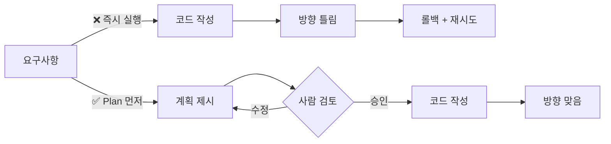
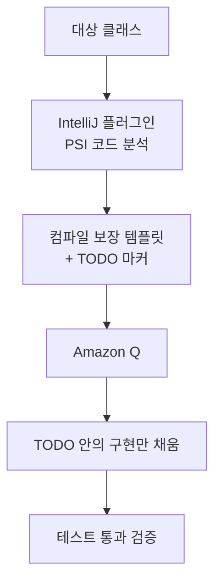

# 2.2 Plan-based Execution

> 실행 전에 합의하기

## 문제: "어, 이게 아닌데"

AI 에이전트를 써본 분이라면 한 번쯤 겪어본 장면이 있습니다.

1. "이런 기능 만들어줘"라고 짧게 지시
2. 에이전트가 10분간 열심히 코드를 씀
3. 결과물을 보니 방향이 완전히 다름
4. 다시 10분. 또 이상함. 롤백.

문제는 **AI가 멍청해서**가 아닙니다. 문제는 **여러분도 처음엔 무엇을 원하는지 몰랐다는 것**입니다. 말로 지시하는 순간 그 불명확함이 그대로 코드에 박힙니다.

## Plan Mode가 바꾸는 것

Plan Mode는 "코드 쓰기 전에 무엇을 할지 먼저 말해달라"는 요청입니다. 단순하지만 결정적입니다.

이 한 단계가 생기는 것만으로:
- **잘못된 방향을 조기에 차단**
- **사람이 무엇을 원하는지 말로 뱉어보게 만듦** (자기 요구사항의 불명확함을 스스로 발견)
- **다른 사람에게도 공유 가능한 산출물(플랜)이 남음**

## 좋은 플랜 vs 나쁜 플랜

| 나쁜 플랜 | 좋은 플랜 |
|---|---|
| "로그인 기능을 만들겠습니다" | "1) 기존 `auth/` 모듈 확인 → 2) `User` 모델에 필드 추가 → 3) `/api/login` 엔드포인트 → 4) 테스트 3개" |
| 추상적 | 파일·함수 단위로 구체적 |
| 검증 기준 없음 | "어떻게 됐을 때 완료인가" 명시 |
| AI가 혼자 한 설명 | 기존 코드를 읽고 그 위에서 제안 |

**나쁜 플랜의 공통점**: 사람이 검토해도 무엇을 승인하는지 모름 → 플랜의 의미가 사라짐.

## 🛠️ 미니 실습 (3분)

같은 요구사항을 두 번 시도해봅니다.

**요구사항**: "사용자 목록 페이지에 검색 기능 추가"

1. **첫 번째**: Plan Mode 없이 바로 실행
2. **두 번째**: Plan Mode로 계획 먼저 받고 → 검토 → 승인 → 실행

두 결과를 비교해보세요. 대부분 두 번째가:
- 더 적은 수정
- 기존 코드와 더 잘 맞음
- 예상 못 한 파일 변경 없음

---

## 💼 현장 사례: 강규한 (우아한형제들 백엔드) — 풀스토리

Part 1.1에서 10% 실패로 끝난 이야기의 뒷이야기입니다.

### 1단계: 전부 맡기기의 실패

- 레포 7개, 테스트 커버리지 부족
- Gemini API 붙여서 **100% 자동 테스트 생성** 시도
- 결과: **10개 중 1개만 컴파일** (10%)
- import 깨짐, 없는 클래스 참조, 기존 테스트 덮어쓰기

### 2단계: 발상의 전환

규한님이 던진 질문:

> **"AI가 못하는 게 뭐지? 못하는 건 AI한테 시키면 안 되는 거 아닌가?"**

| 역할 | 담당 |
|---|---|
| AI가 **잘하는 것**: 구현 로직 작성 | → Amazon Q가 담당 |
| AI가 **못하는 것**: 컨벤션 준수, 컴파일 보장 | → IntelliJ 플러그인 (PSI 분석)이 담당 |

### 3단계: 사람+AI 역할 분담 구조

**플러그인이 제약(컨벤션·컴파일)을 잡고, AI는 그 제약 안에서만 자유롭게 구현**합니다.

### 결과

| 지표 | Before (전부 맡기기) | After (역할 분담) |
|---|---|---|
| 테스트 1개 작성 시간 | 10분 | **3분** (70% ↓) |
| 컴파일 성공률 | 10% (첫 시도) | **95%** |
| 메서드 커버리지 | 67% | **95%** |
| 100개 테스트 생성 | 며칠 | **30분** (97개 통과) |

> 출처: [AI와 함께하는 테스트 자동화: 플러그인 개발기](https://techblog.woowahan.com/24568/) (강규한, 2025.12)

### 이 사례가 말하는 것

규한님의 접근은 사실 **가장 본질적인 의미의 "Plan"** 입니다. Plan Mode라는 기능을 쓴 게 아니라, "무엇은 누가 할지"를 먼저 정한 것. 그게 플랜의 본질입니다.

> **AI의 한계를 인정하는 것이 오히려 자동화의 시작이었습니다.** — 강규한

## 여러분 팀에서 시작하는 법

1. 지금 AI에게 "전부 맡기고" 있는 작업이 뭔가?
2. 그 작업에서 AI가 **자주 실패하는 부분**이 뭔가?
3. 그 실패하는 부분을 **코드·도구·템플릿**으로 대신 잡아줄 수 있는가?
4. 나머지만 AI에게 맡기면?

이 4가지 질문을 돌리는 것 자체가 Plan-based Execution입니다.
