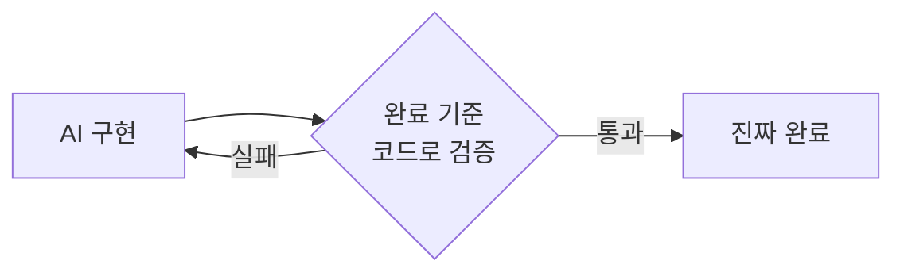
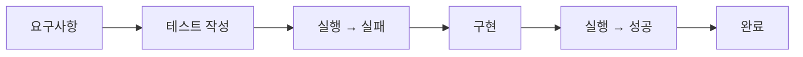
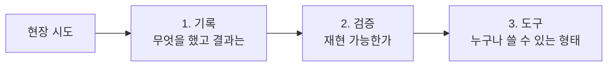

# 2.4 Quality Verification — 품질 검증 체계

> "완료"를 코드로 강제하기

## "완료"라는 단어의 함정

AI 에이전트가 "완료했습니다"라고 말할 때, 그 "완료"는 누구의 기준인가요?

- 여러분이 생각한 완료?
- 테스트 통과?
- 컴파일 성공?
- 린트 통과?
- 리뷰 반영?
- 실제로 동작?

대부분의 경우 — **아무 기준도 없습니다.** 에이전트가 스스로 "이 정도면 됐다"고 판단한 것뿐입니다. 그리고 그 판단은 자주 틀립니다.

## 원칙: "완료의 정의"는 코드에 있어야 한다

사람의 머릿속에 있는 "완료"는 검증할 수 없습니다. 코드에 박혀 있는 "완료"만 검증 가능합니다.



**완료 기준을 코드로 만드는 4가지 도구:**

1. **테스트** — 기능이 의도대로 동작하는가
2. **훅(Hook)** — 커밋 전 자동 검증 (lint, type, format)
3. **리뷰 에이전트** — 코드 자체의 품질·일관성
4. **지표 검증** — 벤치마크·성능 기준

## 전략 1: TDD × 에이전트

가장 강력한 조합입니다. 에이전트에게 **테스트를 먼저 쓰게** 하고, 그 테스트를 통과시키는 코드만 쓰게 합니다.



**왜 효과적인가:**

- 테스트가 **완료의 정의** 역할을 한다
- 에이전트가 "작동하는 것 같은 코드"를 쓰기 어렵다 — 테스트가 거짓말을 안 한다
- 나중에 요구사항이 바뀌어도 테스트가 가드레일이 된다

### 안티패턴: "구현 먼저, 테스트는 나중에"

에이전트에게 코드부터 쓰게 하면:
- 자기 코드에 맞는 테스트를 씀 → **테스트가 있어도 무의미**
- 엣지 케이스를 놓침
- "녹색 체크"만 달성하려는 유혹

**순서가 결정적입니다. 테스트가 먼저.**

## 전략 2: 훅(Hook)으로 자동 차단

사람도 AI도 까먹을 수 있습니다. **깜빡해도 안전한 구조**를 만드는 게 훅입니다.

- `pre-commit`: lint, type check, format 자동 실행
- `pre-push`: 테스트 실행
- Claude Code 훅: 파일 수정 후 자동으로 검증 커맨드 실행

**예시 시나리오:**

1. AI가 코드 수정
2. 훅이 자동으로 `pnpm lint` 실행
3. 실패 시 → 커밋 차단, AI에게 에러 전달
4. AI가 수정 → 재검증 → 통과해야 진행

훅은 **"방심의 비용"을 0으로** 만듭니다.

## 전략 3: 리뷰 에이전트

자기가 쓴 코드를 자기가 리뷰하면 **편향**이 생깁니다. 이건 사람도 마찬가지입니다. 그래서 **독립된 리뷰 에이전트**가 필요합니다.

- Implement Agent: 기능 구현
- Review Agent: 변경분만 받아 검토 (구현 과정은 모름)

Part 2.5에서 본 패턴 1(Plan/Impl/Review 분리)이 여기서 다시 등장합니다. **멀티 에이전트는 결국 품질 검증의 한 형태**입니다.

## 🛠️ 미니 실습 (3분)

### 과제

"간단한 함수 하나를 TDD로 에이전트에게 시키기"

### 나쁜 방식

```
"문자열을 받아서 첫 글자만 대문자로 바꾸는 함수 만들어줘"
```

→ 에이전트가 구현 + 간단한 테스트 → "완료"
→ 근데 빈 문자열 들어오면 터짐

### 좋은 방식

```
"capitalize(s: string) 함수의 테스트를 먼저 작성해줘.
케이스: 1) 일반 문자열 2) 빈 문자열 3) 이미 대문자 4) 공백만
테스트 실행해서 전부 실패하는 것 확인한 다음, 구현해줘."
```

→ 테스트 4개 실패 → 구현 → 4개 통과 → 완료

**차이**: 엣지 케이스를 에이전트가 스스로 발견한 게 아니라, 여러분이 먼저 정했습니다. 이게 "완료의 정의"입니다.

---

## 💼 현장 사례: 본인 — "기록 → 검증 → 도구" 3단계 승격

이건 강사 본인의 이야기입니다. 코드 품질이 아니라 **지식·경험의 품질 검증** 사례라 조금 다른 층위지만, 원리는 똑같습니다.

### 문제: 7년간 축적한 게 아니라, 7년간 반복하고 있었다

저는 우아한테크코스에서 7년간 코치로 일했습니다. "현장 경험이 많다"고 자부했는데, 어느 순간 깨달았습니다.

- 경험이 **제 머릿속과 개인 노트에만** 있었다
- 후임 코치가 와도 **재현이 안 됐다**
- "이거 좋았어요"라는 **구전에 의존**하고 있었다

> **축적이 아니라 반복이었습니다.**

### 해결: 3단계 승격 파이프라인



| 단계 | 의미 | 통과 조건 |
|---|---|---|
| **1. 기록** | 한 번이라도 해본 것 | "뭘 했는지" 글로 남김 |
| **2. 검증** | 다른 사람도 재현 | 내가 없어도 성공하는가? |
| **3. 도구** | 누구나 쓸 수 있는 형태 | 스크립트·템플릿·문서화된 프로세스 |

### 핵심 원칙

> **모든 경험이 자산이 되는 게 아닙니다. 검증된 것만 올라갑니다.**

현재 상태:
- 기록 11건
- 승격된 도구 1건
- 나머지는 검증 대기 중

숫자만 보면 초라합니다. 하지만 **"기억에 의존하는 7년"보다 "기록되고 검증되는 1건"이 낫습니다.**

### 이 사례가 말하는 것 (개발자 버전)

AI 에이전트가 만든 코드도 똑같이 3단계로 봐야 합니다:

| 단계 | 코드 작업 |
|---|---|
| **1. 기록 (Implement)** | 일단 돌아가는 코드 |
| **2. 검증 (Verify)** | 테스트·리뷰로 재현성 확인 |
| **3. 도구 (Productize)** | 라이브러리·공통 모듈로 승격 |

**1단계에서 바로 "완료"를 선언하는 게 바로 품질 검증의 부재**입니다. 에이전트가 뱉은 코드는 전부 "기록" 단계일 뿐입니다. 거기서 멈추면 축적되지 않습니다.

## 흔한 오해

### "테스트 커버리지 100%면 품질 OK?"

커버리지는 **라인이 실행되었는가**만 봅니다. **그 라인이 올바른가**는 안 봅니다. 의미 없는 테스트를 AI가 잔뜩 써두면 커버리지는 올라가고 품질은 그대로입니다.

→ **커버리지 숫자보다 "엣지 케이스 테스트가 있는가"가 더 중요**합니다.

### "리뷰 에이전트가 놓친 건 어쩌지?"

Review Agent도 완벽하지 않습니다. **사람 리뷰 + AI 리뷰** 두 층이 기본입니다. AI 리뷰는 "명백한 실수"를 걸러내고, 사람 리뷰는 "설계 판단"을 봅니다.

## 여러분 팀에서 시작하는 법

1. 지금 프로젝트에 **자동 검증**이 몇 개나 있는지 세보세요 (lint·test·type)
2. 가장 약한 쪽을 **훅**에 추가하세요
3. 에이전트에게 작업 시킬 때 **"완료의 정의"를 먼저 말하는 습관**을 들이세요
4. "완료" 선언이 나오면 **독립적으로 한 번 더 검증**하세요 (새 세션, 또는 Review Agent)

## 정리

- "완료"는 사람의 판단이 아니라 **코드로 검증 가능한 기준**이어야 한다
- 4가지 도구: 테스트 · 훅 · 리뷰 에이전트 · 지표
- **TDD × 에이전트**가 가장 강력한 조합
- AI가 만든 코드는 **"기록" 단계일 뿐**, 검증·승격을 거쳐야 자산이 된다
