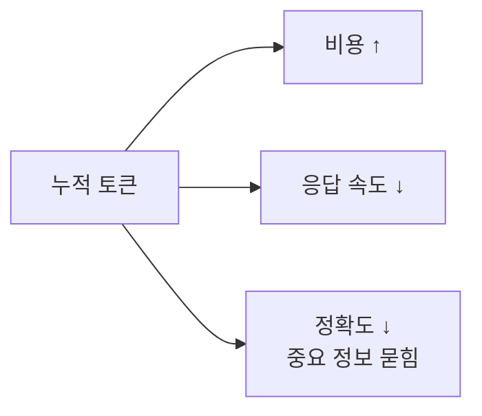

# 2.3 Token & Context Optimization

> 길게 일하는 법

## 왜 토큰이 문제인가

AI 에이전트를 써보면 어느 순간 이상한 일이 생깁니다.

- 처음엔 똑똑하게 대답하던 에이전트가
- 대화가 길어지면 같은 말을 반복하거나
- 방금 전에 한 결정을 까먹거나
- "이 파일을 다시 읽어볼게요"라며 같은 파일을 10번째 읽음

이건 에이전트가 멍청해진 게 아닙니다. **컨텍스트 윈도우가 고갈되고 있는 것**입니다.

## 컨텍스트 윈도우의 경제학

LLM은 매 턴마다 **지금까지의 모든 대화 + 시스템 프롬프트 + 도구 호출 결과**를 다시 읽습니다. 대화가 길어질수록:

- **토큰 사용량** = 턴 수 × 누적 컨텍스트 크기
- **비용** = 토큰 × 단가
- **정확도** = 컨텍스트가 꽉 찰수록 ↓ (중요한 정보가 묻힘)

**즉, 토큰은 세 가지를 동시에 잡아먹습니다: 시간·돈·정확도.**



## 3가지 전략

### 전략 1: 압축 (Compression)

긴 작업 중간에 **"지금까지 한 것 요약하고 나머지는 버려"** 라고 요청합니다. Claude Code의 `/compact` 명령이 대표적입니다.

- Before: 50턴 대화, 토큰 80% 사용
- After: 핵심 결정만 남은 요약 5문장, 토큰 20%

**언제 쓰는가**: 긴 디버깅이 끝나고 "이제 다른 작업으로 넘어갈 때".

### 전략 2: 분할 (Chunking)

큰 작업을 **작은 작업으로 쪼개서** 각각 독립 세션으로 진행합니다. 세션 간에는 산출물(코드·문서)만 전달합니다.

| ❌ 한 세션에 다 | ✅ 세션 분할 |
|---|---|
| "이 모듈 전체 리팩터링" | 1) 타입 정의 정리 → 2) 유틸 함수 분리 → 3) 메인 로직 → 각 세션 |
| 중간쯤 가면 컨텍스트 고갈 | 각 세션이 fresh하게 시작 |
| 앞에서 내린 결정을 뒤에서 까먹음 | 결정은 커밋 메시지·CLAUDE.md에 기록 |

### 전략 3: 격리 (Isolation via Subagents)

토큰을 많이 먹는 작업(코드베이스 탐색, 긴 로그 분석, 큰 문서 요약)을 **서브에이전트에게 위임**합니다. 서브에이전트의 컨텍스트는 작업 후 버려지고, Main은 **요약본만** 받습니다.

이게 Part 2.5(멀티 에이전트)와 맞닿는 지점입니다. **토큰 절약의 가장 효과적인 방법은 에이전트 분리입니다.**

## 🤖 AI Pro에서는?

| 전략 | Claude Code | AI Pro |
|---|---|---|
| **압축** | `/compact` | **Chat History 압축** (CLI 기본 기능, gemini-cli 기반) |
| **분할** | 새 세션 + 산출물 전달 | 새 Chat 시작 (히스토리 아이콘 → New Chat) + Pre-set Prompt로 컨텍스트 재진입 |
| **격리** | 서브에이전트 (Task) | **Skills 직접 호출** (`/skill-name`) — 작업을 좁힌 Skill로 위임하면 자연스러운 격리 |
| **불필요 파일 차단** | `.gitignore` | **`.aiproignore`** + **`.geminiignore`** (둘 다 지원) |
| **인덱싱 통제** | (자동) | Settings → **Workspace Indexing** 토글 + re-index 버튼 |

특히 **`.aiproignore`** 는 토큰 절약의 가장 빠른 첫걸음입니다. 예시:

```gitignore
node_modules
*.sql
secrets.json
.env
*.log
```

`{USER_HOME}/.aipro/.aiproignore` 위치에 두면 모든 프로젝트에 적용됩니다.

## 🛠️ 미니 실습 (3분)

> **실습 저장소**: [steps/step-3-token/](https://github.com/imakerjun/agentic-coding-sample/tree/main/steps/step-3-token) — 의도적인 잡음 파일들(logs, fake node_modules, secrets)이 들어 있어 `.aiproignore`의 효과를 즉시 체감할 수 있습니다.

긴 작업을 끊어가며 진행하는 감을 익혀봅니다.

### 과제

"이 프로젝트의 에러 처리 패턴을 전부 찾아서 문서화"

### 나쁜 방식

Main에게 바로 시킴 → 수십 개 파일을 한 세션에 로드 → 토큰 고갈 → 중간에 "이 파일 다시 읽어볼게요" 루프

### 좋은 방식 (격리 + 분할)

1. Main: "서브에이전트로 `try/catch` 쓰는 파일 리스트만 받아와"
2. Sub → 파일 경로 리스트만 반환 (요약)
3. Main: "이 리스트를 5개씩 묶어서 각 그룹별로 패턴 추출해"
4. 각 그룹마다 독립 서브에이전트
5. Main은 그룹별 요약만 받아 최종 문서 작성

**Main의 컨텍스트 사용량 비교**: 방식 1은 80%+, 방식 2는 20% 이하로 끝납니다.

---

## 💼 현장 사례: HumanLayer — "Sub-agents as Context Firewall"

[HumanLayer (Dexter Horthy 외)](https://www.humanlayer.dev/blog/skill-issue-harness-engineering-for-coding-agents)가 복잡한 엔터프라이즈 코드베이스에서 수개월간 어려운 문제를 풀어가며 정리한 패턴입니다. 토큰 최적화의 정수를 한 단어로 압축한 인용으로 유명합니다.

### 핵심 인용

> **"Sub-agents function as a context firewall that ensures discrete tasks can run in isolated context windows so none of the intermediate noise accumulates in your parent thread which is responsible for orchestration."**
>
> — HumanLayer

### 무엇을 말하는가

서브에이전트는 **"컨텍스트 방화벽"** 입니다. 비유 그대로 작동합니다:

- 작업을 서브에이전트에게 위임하면, 그 안의 **모든 중간 도구 호출·결과·메시지는 부모 스레드로 새지 않습니다**
- 부모(Main)는 **자기가 보낸 프롬프트와 서브에이전트의 최종 결과만** 봅니다
- 그 결과 Main의 컨텍스트가 **"smart zone"** 안에 오래 머뭅니다

### HumanLayer의 실전 적용

HumanLayer 팀은 다음 작업을 모두 서브에이전트에 위임해 부모 스레드를 보호합니다:

- **Research** (코드베이스 탐색·문서 읽기)
- **Implementation** (특정 기능 구현)
- 그 외 **컨텍스트-집약적 작업**

> *"Breaking work up into discrete tasks and delegating it to sub-agents is how we keep our primary coding agent thread in the 'smart zone.'"*

### 이 사례가 강의에 주는 교훈

| 강의 메시지 | HumanLayer의 표현 |
|---|---|
| 토큰 절약은 비용보다 **품질·정확도** 문제 | "Smart zone에서 벗어나면 같은 모델이어도 멍청해진다" |
| 격리(isolation)가 가장 강력 | "Context firewall" |
| 멀티 에이전트는 토큰 전략의 결과 (Part 2.5) | "이게 우리가 매일 쓰는 방식" |

> 출처: [Skill Issue: Harness Engineering for Coding Agents](https://www.humanlayer.dev/blog/skill-issue-harness-engineering-for-coding-agents) — HumanLayer Blog

### 여러분이 적용하는 법

1. **지금 Main에게 시키는 작업 중 토큰을 많이 먹는 것**을 하나 고르세요 (보통 코드 탐색·로그 분석·문서 요약)
2. 그 작업을 **서브에이전트에게 격리**하세요
   - Claude Code: Task tool로 서브에이전트 호출
   - AI Pro: Skills로 같은 효과 (`/skill-name` 또는 자동 트리거)
3. Main이 받는 건 **요약본**이어야 합니다 — 원시 데이터가 흘러들면 격리의 의미가 없습니다

이게 바로 **"context firewall"** 입니다. 한 줄로 외워두면 평생 갑니다.

## 흔한 오해 3가지

### 오해 1: "컨텍스트 윈도우가 크면 다 되는 거 아닌가?"

아닙니다. 윈도우가 커도 **중간에 있는 정보는 흐려집니다**.

이건 직관적인 추측이 아니라 학술적으로 입증된 현상입니다. Stanford·UC Berkeley·Samaya AI 연구진의 [**"Lost in the Middle: How Language Models Use Long Contexts"**](https://arxiv.org/abs/2307.03172) (Liu et al., 2023) 논문이 핵심 결과를 보여줍니다:

> **"성능은 관련 정보가 입력 컨텍스트의 시작이나 끝에 있을 때 가장 높고, 중간에 있을 때 크게 떨어진다 — 명시적으로 long-context를 표방하는 모델조차도."**

GPT-3.5·Claude 1.3 등 당시 최신 모델 모두에서 같은 U자 패턴이 관찰되었습니다. 이후 모델들이 개선됐지만 패턴 자체가 사라진 건 아닙니다.

**결론**: 큰 윈도우는 **안전 마진**이지 **만능 해결책**이 아닙니다.

### 오해 2: "일단 다 넣고 알아서 골라 쓰라고 하면 되지"

AI는 "필요한 것만 고른다"를 잘 못합니다. 불필요한 정보가 많으면 그중 일부를 "중요해 보이는 것"으로 착각해서 엉뚱한 방향으로 갑니다. **덜 주는 게 더 잘 되는 역설**이 자주 일어납니다.

### 오해 3: "토큰 아끼기는 비용 이슈 아닌가?"

비용보다 **정확도와 속도**가 더 큰 영향입니다. 토큰 절약은 돈 이슈가 아니라 **품질 이슈**입니다.

## 여러분 팀에서 시작하는 법

1. 지금 하는 작업 중 **5턴 이상** 가는 대화가 있는지 보세요
2. 그중 **중복으로 파일을 다시 읽는** 부분이 있는지 확인
3. 있다면 → 그 부분을 **서브에이전트로 격리**하거나 **세션 분할**
4. Main의 컨텍스트가 "핵심 결정"만 남도록 유지

## 정리

- 토큰 최적화 = 비용 문제가 아니라 **품질·정확도 문제**
- 3가지 전략: **압축 / 분할 / 격리**
- 격리(서브에이전트)는 2.5와 직결
- "길게 가는 작업"에서 차이가 극적으로 벌어짐
