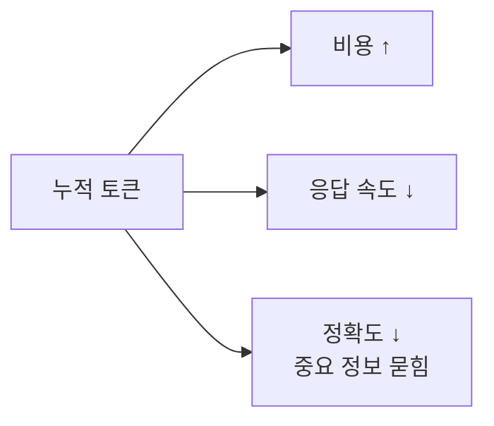

# 2.3 Token & Context Optimization

> 길게 일하는 법

## 왜 토큰이 문제인가

AI 에이전트를 써보면 어느 순간 이상한 일이 생깁니다.

- 처음엔 똑똑하게 대답하던 에이전트가
- 대화가 길어지면 같은 말을 반복하거나
- 방금 전에 한 결정을 까먹거나
- "이 파일을 다시 읽어볼게요"라며 같은 파일을 10번째 읽음

이건 에이전트가 멍청해진 게 아닙니다. **컨텍스트 윈도우가 고갈되고 있는 것**입니다.

## 컨텍스트 윈도우의 경제학

LLM은 매 턴마다 **지금까지의 모든 대화 + 시스템 프롬프트 + 도구 호출 결과**를 다시 읽습니다. 대화가 길어질수록:

- **토큰 사용량** = 턴 수 × 누적 컨텍스트 크기
- **비용** = 토큰 × 단가
- **정확도** = 컨텍스트가 꽉 찰수록 ↓ (중요한 정보가 묻힘)

**즉, 토큰은 세 가지를 동시에 잡아먹습니다: 시간·돈·정확도.**



## 3가지 전략

### 전략 1: 압축 (Compression)

긴 작업 중간에 **"지금까지 한 것 요약하고 나머지는 버려"**라고 요청합니다. Claude Code의 `/compact` 명령이 대표적입니다.

- Before: 50턴 대화, 토큰 80% 사용
- After: 핵심 결정만 남은 요약 5문장, 토큰 20%

**언제 쓰는가**: 긴 디버깅이 끝나고 "이제 다른 작업으로 넘어갈 때".

### 전략 2: 분할 (Chunking)

큰 작업을 **작은 작업으로 쪼개서** 각각 독립 세션으로 진행합니다. 세션 간에는 산출물(코드·문서)만 전달합니다.

| ❌ 한 세션에 다 | ✅ 세션 분할 |
|---|---|
| "이 모듈 전체 리팩터링" | 1) 타입 정의 정리 → 2) 유틸 함수 분리 → 3) 메인 로직 → 각 세션 |
| 중간쯤 가면 컨텍스트 고갈 | 각 세션이 fresh하게 시작 |
| 앞에서 내린 결정을 뒤에서 까먹음 | 결정은 커밋 메시지·CLAUDE.md에 기록 |

### 전략 3: 격리 (Isolation via Subagents)

토큰을 많이 먹는 작업(코드베이스 탐색, 긴 로그 분석, 큰 문서 요약)을 **서브에이전트에게 위임**합니다. 서브에이전트의 컨텍스트는 작업 후 버려지고, Main은 **요약본만** 받습니다.

이게 Part 2.5(멀티 에이전트)와 맞닿는 지점입니다. **토큰 절약의 가장 효과적인 방법은 에이전트 분리입니다.**

## 🤖 AI Pro에서는?

| 전략 | Claude Code | AI Pro |
|---|---|---|
| **압축** | `/compact` | **Chat History 압축** (CLI 기본 기능, gemini-cli 기반) |
| **분할** | 새 세션 + 산출물 전달 | 새 Chat 시작 (히스토리 아이콘 → New Chat) + Pre-set Prompt로 컨텍스트 재진입 |
| **격리** | 서브에이전트 (Task) | **Skills 직접 호출** (`/skill-name`) — 작업을 좁힌 Skill로 위임하면 자연스러운 격리 |
| **불필요 파일 차단** | `.gitignore` | **`.aiproignore`** + **`.geminiignore`** (둘 다 지원) |
| **인덱싱 통제** | (자동) | Settings → **Workspace Indexing** 토글 + re-index 버튼 |

특히 **`.aiproignore`** 는 토큰 절약의 가장 빠른 첫걸음입니다. PDF 가이드 예시:

```gitignore
node_modules
*.sql
secrets.json
.env
*.log
```

`{USER_HOME}/.aipro/.aiproignore` 위치에 두면 모든 프로젝트에 적용됩니다.

## 🛠️ 미니 실습 (3분)

긴 작업을 끊어가며 진행하는 감을 익혀봅니다.

### 과제

"이 프로젝트의 에러 처리 패턴을 전부 찾아서 문서화"

### 나쁜 방식

Main에게 바로 시킴 → 수십 개 파일을 한 세션에 로드 → 토큰 고갈 → 중간에 "이 파일 다시 읽어볼게요" 루프

### 좋은 방식 (격리 + 분할)

1. Main: "서브에이전트로 `try/catch` 쓰는 파일 리스트만 받아와"
2. Sub → 파일 경로 리스트만 반환 (요약)
3. Main: "이 리스트를 5개씩 묶어서 각 그룹별로 패턴 추출해"
4. 각 그룹마다 독립 서브에이전트
5. Main은 그룹별 요약만 받아 최종 문서 작성

**Main의 컨텍스트 사용량 비교**: 방식 1은 80%+, 방식 2는 20% 이하로 끝납니다.

---

## 💼 현장 사례: 우아한형제들 — 1,300개 파일을 3분에

우아한형제들 기술블로그에 공개된 [김사랑 님의 글](https://techblog.woowahan.com/26034/)에서 가져온 사례입니다.

### 상황

개발팀에 이런 작업이 떨어졌습니다:

> "프로젝트 전체에서 **1,300개 파일의 이름을 규칙에 맞춰 변경**해야 합니다. 가능한 빨리."

사람이 손으로? **며칠**. 스크립트로? 규칙이 단순하지 않아서 복잡함. IDE 리팩터링? 파일명과 import가 얽혀서 안정적이지 않음.

### 해결

해당 팀의 접근은 **분할 + 격리**의 정석이었습니다:

1. **규칙을 먼저 명문화** (Context)
2. **에이전트에게 한 번에 다 시키지 않음** — 폴더별로 분할
3. 각 폴더 작업을 **독립 세션**으로 실행
4. 각 세션은 그 폴더에만 집중 (컨텍스트 오염 없음)
5. 결과 검증 → 다음 폴더

### 결과

**1,300개 파일 이름 변경 — 3분.**

사람이 며칠 걸릴 작업이 3분으로 줄어든 건 "AI가 빨라서"가 아닙니다. **토큰·컨텍스트를 의식한 작업 분할** 덕분입니다.

### 이 사례가 말하는 것

- **"AI로 대량 작업"의 병목은 AI가 아니라 작업 설계**
- 분할이 잘 되면 각 세션이 독립적으로 병렬 실행 가능
- 각 세션이 짧을수록 정확도가 높음

## 흔한 오해 3가지

### 오해 1: "컨텍스트 윈도우가 크면 다 되는 거 아닌가?"

아닙니다. 윈도우가 커도 **중간에 있는 정보는 흐려집니다**.

이건 직관적인 추측이 아니라 학술적으로 입증된 현상입니다. Stanford·UC Berkeley·Samaya AI 연구진의 [**"Lost in the Middle: How Language Models Use Long Contexts"**](https://arxiv.org/abs/2307.03172) (Liu et al., 2023) 논문이 핵심 결과를 보여줍니다:

> **"성능은 관련 정보가 입력 컨텍스트의 시작이나 끝에 있을 때 가장 높고, 중간에 있을 때 크게 떨어진다 — 명시적으로 long-context를 표방하는 모델조차도."**

GPT-3.5·Claude 1.3 등 당시 최신 모델 모두에서 같은 U자 패턴이 관찰되었습니다. 이후 모델들이 개선됐지만 패턴 자체가 사라진 건 아닙니다.

**결론**: 큰 윈도우는 **안전 마진**이지 **만능 해결책**이 아닙니다.

### 오해 2: "일단 다 넣고 알아서 골라 쓰라고 하면 되지"

AI는 "필요한 것만 고른다"를 잘 못합니다. 불필요한 정보가 많으면 그중 일부를 "중요해 보이는 것"으로 착각해서 엉뚱한 방향으로 갑니다. **덜 주는 게 더 잘 되는 역설**이 자주 일어납니다.

### 오해 3: "토큰 아끼기는 비용 이슈 아닌가?"

비용보다 **정확도와 속도**가 더 큰 영향입니다. 토큰 절약은 돈 이슈가 아니라 **품질 이슈**입니다.

## 여러분 팀에서 시작하는 법

1. 지금 하는 작업 중 **5턴 이상** 가는 대화가 있는지 보세요
2. 그중 **중복으로 파일을 다시 읽는** 부분이 있는지 확인
3. 있다면 → 그 부분을 **서브에이전트로 격리**하거나 **세션 분할**
4. Main의 컨텍스트가 "핵심 결정"만 남도록 유지

## 정리

- 토큰 최적화 = 비용 문제가 아니라 **품질·정확도 문제**
- 3가지 전략: **압축 / 분할 / 격리**
- 격리(서브에이전트)는 2.5와 직결
- "길게 가는 작업"에서 차이가 극적으로 벌어짐
