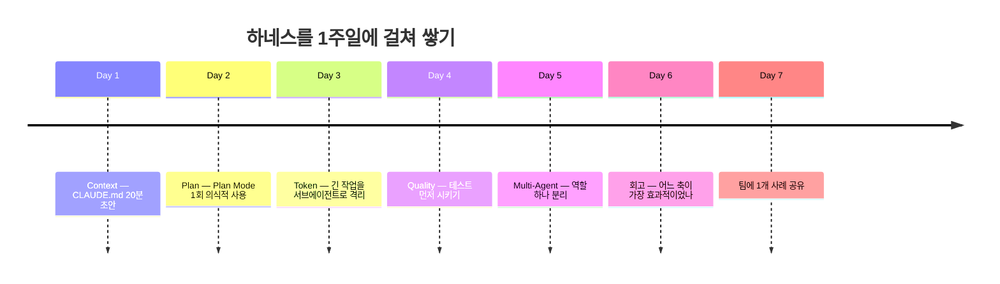

# 3.2 나의 1주일 적용 가이드

> 한 번에 5가지 축을 다 적용하려 하지 마세요. **하루 한 개씩 쌓는 1주일**이 현실적이고, 3주가 지나면 다시 안 할 수 없는 습관이 됩니다.

## 왜 "1주일"인가

- 하루에 하나는 너무 적어 보이지만, 5일이면 **5가지 축 전부**를 한 번씩 만납니다.
- 주말에 짧게 회고하면 6일 만에 자기만의 "하네스 초안"이 생깁니다.
- 1주일은 학습 단위이자 실패해도 부담 없는 단위입니다. 실패 비용이 낮아야 시도합니다.

## 한눈에 보기



---

## Day 1 — Context Engineering

**목표**: 여러분 프로젝트에 CLAUDE.md를 만들어 커밋한다.

- 소요: 20분
- 방법: [3.1 CLAUDE.md를 시작하는 법](./starting-claude-md)의 템플릿 사용
- 완료 기준: 커밋 1개, "AI가 자주 헤매는 것" 섹션에 3개 이상 적혀 있음

**체크**: 내일부터 새 세션을 열 때 같은 설명을 반복하지 않는가?

---

## Day 2 — Plan-based Execution

**목표**: 오늘 해야 할 작업 하나를 Plan Mode로 시도한다.

- 소요: 평소 작업 + 5분
- 방법: 평소처럼 요청하지 말고 **"먼저 계획을 보여줘"** 라고 명시적으로 요청
- 비교 포인트: 어제까지의 즉시 실행과 뭐가 달랐는가?

**체크**: 플랜을 보고 수정 요청한 적이 있는가? (있다면 성공 — 그게 Plan의 본질)

---

## Day 3 — Token & Context Optimization

**목표**: 긴 작업 하나를 의도적으로 **쪼개거나 서브에이전트로 위임**한다.

- 소요: 평소 작업 + 10분
- 방법 A (분할): 한 세션에 다 하지 말고 2~3개 세션으로 나누기
- 방법 B (격리): "서브에이전트로 X를 조사한 뒤 결과만 나한테 줘"
- 관찰: Main의 응답 속도가 빨라지고 혼선이 줄어드는가?

**체크**: 오늘 "이 파일 다시 읽어볼게요" 같은 루프가 몇 번 있었나? 어제보다 줄었나?

---

## Day 4 — Quality Verification

**목표**: 작업 하나에 **테스트를 먼저** 시켜본다.

- 소요: 평소 작업 + 5분
- 방법: "구현하기 전에 테스트를 먼저 써줘. 케이스는 1) ___ 2) ___ 3) ___"
- 효과: AI가 스스로 엣지 케이스를 놓치는 일이 줄어듬

**체크**: "완료" 선언이 여러분의 기준과 일치했는가? 아니면 또 헤맸는가?

---

## Day 5 — Multi-Agent Orchestration

**목표**: 지금 한 에이전트에 몰려 있는 역할 중 **하나를 분리**한다.

- 소요: 평소 작업 + 10분
- 방법 (가장 쉬운 시작): 코드 탐색 작업만 서브에이전트로 격리
- 예: "서브에이전트로 `auth/` 폴더에서 세션 관련 파일 찾아줘. 결과 리스트만 반환"

**체크**: Main의 컨텍스트가 깨끗하게 유지되는가?

---

## Day 6 — 회고

**목표**: 한 주 동안 어느 축이 가장 효과적이었는지 기록한다.

### 3가지 질문

1. **5가지 축 중 체감이 가장 컸던 것은?** 왜?
2. **가장 어색했던 것은?** 왜?
3. **CLAUDE.md에 새로 추가할 규칙이 있는가?** (지난 5일간 AI가 또 헤맨 것)

### 기록 형식

```markdown
# 나의 하네스 회고 — Week 1

## 가장 효과적이었던 축
- 예: Plan Mode. 월요일 작업에서 방향 수정 30분 → 5분.

## 가장 어색했던 축
- 예: Multi-Agent. 역할 분리가 처음엔 번거로웠음. 다음 주 다시 시도.

## CLAUDE.md에 추가한 규칙
- 예: "에러 메시지는 한글, 로그는 영어"
```

이 기록이 **여러분만의 하네스 v1**입니다. 거창할 필요 없습니다. **기록된 것만이 자산입니다** (Part 2.4 본인 사례).

---

## Day 7 — 팀에 사례 하나 공유

**목표**: 한 주 동안 가장 효과가 컸던 1가지를 팀원에게 **사례로** 공유한다.

- 포맷: 슬랙 1편, 팀 미팅 5분, 또는 위키 1페이지
- 내용: **Before / After + 숫자** (가능하면)
- 예: "Plan Mode로 한 번 검토받았더니 방향 수정 시간이 30분 → 5분으로 줄었어요"

### 왜 공유가 마지막 단계인가

1. 혼자 쓰면 개인 자산. 공유되어야 팀 자산이 될 수 있음.
2. 공유 준비 과정에서 **여러분이 한 일이 의식화**됩니다 — 말로 뱉어야 이해가 완결됩니다.
3. 팀에 "할 만한 거네"라는 신호를 한 번 주면 — Part 4(IF)의 워크숍이 훨씬 쉬워집니다.

---

## 다음 단계

한 주가 지났다면:

- **같은 1주일 사이클을 반복** — 매주 다른 축에 집중
- **Part 4로 이동** — 팀 전체 확산을 고려하고 있다면 [4.1 팀 워크숍](../part-4-if/team-rules-workshop)

## 실패해도 괜찮은 이유

- Day 3에서 막혔다면 Day 4로 넘어가세요. 완주가 목적이 아니라 **감 잡기**가 목적입니다.
- 1주일 계획이 4일 만에 끝나도 성공입니다. 1주일이 2주일이 되어도 성공입니다.
- 0주일이 가장 흔한 실패 패턴이고, 이 가이드는 그것만 피하면 됩니다.

## 체크리스트

- [ ] Day 1 — CLAUDE.md 초안 커밋
- [ ] Day 2 — Plan Mode 1회
- [ ] Day 3 — 분할 또는 격리 1회
- [ ] Day 4 — 테스트 먼저 1회
- [ ] Day 5 — 역할 분리 1회
- [ ] Day 6 — 회고 기록
- [ ] Day 7 — 팀에 사례 1개 공유
