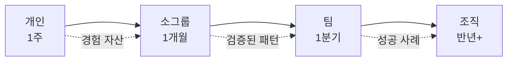

# 4.2 조직 확산 로드맵

> Part 3.2의 **1주일**이 개인의 첫 사이클이었다면, 이 챕터는 **1개월·1분기·반년**의 조직 확산입니다.

## 4단계 로드맵

| 단계 | 기간 | 누가 | 무엇을 |
|---|---|---|---|
| 개인 | 1주 | 나 혼자 | [3.2 1주일 가이드](../part-3-how/week-one-guide) — CLAUDE.md·Plan·Token·Quality·Multi-Agent 각 1회 |
| 소그룹 | 1개월 | 팀 2~5명 | 공통 CLAUDE.md 체크인 + [4.1 워크숍](./team-rules-workshop) 1회 |
| 팀 | 1분기 | 팀 전체 | MCP/패키지로 자산 중앙화, 검증 프로세스 도입 |
| 조직 | 반년~ | 부문·전사 | AI Dive Deep 같은 구조화된 교육 프로그램 |

**핵심**: 각 단계의 산출물이 다음 단계의 입력입니다. 1주일 회고가 1개월 워크숍의 재료가 되고, 1개월 워크숍이 1분기 자산화의 재료가 됩니다.

## 💼 현장 사례: 우아한형제들 — AI Dive Deep

조직 단계의 대표 사례입니다.

### 계기

> 옆자리 PM이 일요일 밤마다 출근했어요. 회의록 정리 때문에. AI 회의록 봇을 같이 만들어보자고 했고요. 30분 뒤 동료가 말합니다. **"어, 이게 되네?"**

이 한 마디가 조직 확산의 방아쇠였습니다.

### 핵심 설계

슬랙에 교육 공지를 올렸더니 **15자리에 40명 지원** — 조기 마감. 설계가 인상적이었습니다.

- AI 사용법부터 가르치지 **않았습니다**
- 지원 조건: **"업무 지시서를 써오라"** — 진짜 힘든 업무를 가져와야 참여 가능

### 결과 (5주 뒤)

| 직군 | Before | After |
|---|---|---|
| PM | 회의록 정리 30분 × 하루 4건 | AI 봇이 자동 작성 |
| 마케터 | 데이터 취합 **150분** | **25분** |
| 디자이너 | Figma 플러그인 외주 대기 | **직접 Cursor로 제작** |
| 개발자 | 1,300개 파일 이름 변경 며칠 | **3분** (Part 2.3 사례) |

### 조직적 영향

- CEO까지 보고 → 전담 TF 구성
- AX TF가 이 흐름에서 출범

### 교훈

> **연습 문제로는 연습밖에 안 됩니다. 진짜 내 문제여야 몰입합니다.**

이 문장이 조직 교육의 전부입니다. 훈련용 데이터셋·가상 시나리오 같은 "교육 재료"로는 진짜 변화가 일어나지 않습니다. **각자가 가져온 진짜 업무**만이 몰입을 만듭니다.

> 출처: [AI로 바뀐 건 업무가 아니라 사람이었습니다](https://techblog.woowahan.com/26034/) (김사랑, 2026.03)

## 삼성SDS 같은 대규모 조직에 적용한다면

일반화하면 이렇게 읽습니다.

1. **작게 시작한 한 사례**를 가장 먼저 확보 (본인 + 동료 한 명이 걸리는 데 걸리는 문제)
2. 그 사례의 Before/After를 **숫자로** 정리
3. 그 숫자가 퍼지기 시작하면 **지원자가 모집 요건을 받아들일 준비**가 됨
4. 교육은 **"업무 지시서 제출"** 같은 진입 비용을 요구 — 이게 몰입 필터
5. 5주 뒤 결과를 조직 전체에 공유 → 다음 코호트

**핵심 원칙 한 줄**: 위에서 "AI 도입하겠습니다"라고 선언하지 말고, 아래에서 **"이게 되네?"** 를 하나만 만들면 됩니다.

## 흔한 실패 패턴

### ❌ "전 직원 AI 교육 수강 의무화"

- 강요 = 저항. 본인이 원하지 않는 교육은 효과 0.
- 대안: 지원자 우선, 정원 제한, 업무 지시서 요구 → 자발성의 필터.

### ❌ "최신 모델로 교체하면 다 해결"

- 문제는 모델이 아니라 **하네스**입니다 (Part 2.0). 모델 교체는 가장 마지막 카드.

### ❌ "성공 사례가 나오면 그때 확산"

- 성공 사례는 저절로 안 나옵니다. **누군가 의도적으로 만들어야** 합니다.
- Part 3.2 가이드를 본인이 먼저 해보고, 그게 사내 첫 사례가 되는 것이 시작.

## 체크리스트

- [ ] 나의 1주일 완료 ([Part 3.2](../part-3-how/week-one-guide))
- [ ] 팀 1~2명에게 1주일 사례 공유
- [ ] 4.1 워크숍 1회 진행
- [ ] 소그룹 CLAUDE.md v1 커밋
- [ ] 1분기 후 확산 계획 수립
- [ ] 조직 차원 교육(AI Dive Deep 류) 제안 초안
